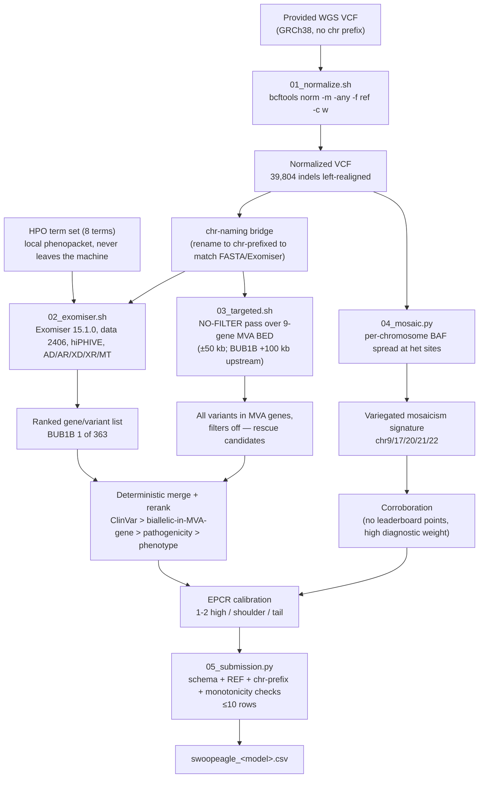

# Track 1 Methods Report — Phenotype-Driven Diagnosis with a No-Filter MVA-Gene Rescue Pass

**Team / HF user:** `swoopeagle` (checkpoint-charlie)
**Challenge:** Rare Disease, Real Kid — The MVA Hackathon 2026 (Sage Bionetworks / MVA Society / Hugging Face / BEACON)
**Proband:** EX2312012
**Code:** <TODO: public repo URL — see `PUBLIC_REPO_PLAN.md`>
**Report version:** draft, 2026-08-26

---

## 1. Summary

Starting from the provided GRCh38 WGS VCF and the proband's HPO term set (8 terms), a fully
automated, public-data-only pipeline ranks **BUB1B** first of 363 candidate genes
(Exomiser combined score 0.650 vs 0.206 for the runner-up; phenotype score 0.59), under an
**autosomal-recessive compound-heterozygous** model:

| Allele | Position (GRCh38) | Class | Supporting evidence |
|---|---|---|---|
| 1 | chr15:40209701 | `stop_gained` | ClinVar Pathogenic/Likely pathogenic; PASS; ultra-rare (population frequency score 1.0) |
| 2 | chr15:40220612 | novel missense | variant pathogenicity 0.92; PASS; ultra-rare; absent from ClinVar |

This is the textbook MVA1 genotype — one truncating allele plus one non-truncating allele —
and it is corroborated by an orthogonal, variant-independent signal: a **variegated
B-allele-frequency (BAF) signature** across chr9, chr17, chr20, chr21 and chr22, i.e. the
mosaic aneuploidy the syndrome is named for, read directly out of the same VCF.

The pipeline is deterministic. No manual curation reorders the ranking; every row of the
submission is produced by documented rules from tool output (§8). It runs in minutes on a
laptop once reference data are downloaded, uses only public tools and public databases, and
costs nothing to run.

---

## 2. Pipeline



Stage scripts, in order: `pipeline/01_normalize.sh`, `pipeline/make_bed.sh`,
`pipeline/02_exomiser.sh`, `pipeline/03_targeted.sh`, `pipeline/04_mosaic.py`,
`pipeline/05_submission.py`.

---

## 3. Normalization discipline

Scoring against a ground-truth variant list is an **exact string match on
(chrom, pos, ref, alt)**. Every representational difference between our VCF and the
scorer's is a silent zero. Two traps were handled explicitly.

**The chromosome-naming trap.** The provided VCF uses bare contig names (`15`), while the
GRCh38 reference FASTA and the official submission template use the `chr` prefix
(template example: `chr15`). Mixing them produces either a hard failure in
`bcftools norm -f` (contig not found in reference) or — worse — a silent pass on the
subset of tools that tolerate both. We therefore keep two named artifacts and a mapping
file in both directions (`chr_add.map` / `chr_drop.map`): the **raw** VCF as received,
and the **normalized, chr-prefixed** VCF used for all downstream tools. Coordinates are
round-tripped back to the raw representation for verification, and **emitted in
chr-prefixed form** because that is what the template shows.

**Left-alignment.** `bcftools norm -m -any -f <ref> -c w` splits multiallelic records into
biallelic ones and left-aligns and trims indels against the reference. **39,804 indels were
realigned** by this step. Any of those, if reported at its pre-normalization position,
would fail an exact-match comparison against a normalized truth set (and vice versa). The
`-c w` mode warns on, rather than silently discards, REF mismatches, so a build or contig
mismatch surfaces as a log line instead of as missing variants.

**Pre-submission check.** `05_submission.py` asserts the schema (≤10 rows, `epcr` in (0,1]
and monotone non-increasing with rank, `chr` prefix present on both members of every pair,
`finding_type ∈ {primary, secondary}`). Each emitted REF allele is additionally verified
against the reference FASTA at the emitted coordinate before submission.

---

## 4. Phenotype-driven prioritization

**Tool:** Exomiser 15.1.0 with the 2406 data release (`2406_hg38`, `2406_phenotype`),
assembly GRCh38, hiPHIVE prioritiser, all inheritance modes enabled (AD, AR, XD, XR, MT).
Input phenotype = the proband's HPO term set (8 terms) rendered locally into a phenopacket;
the phenopacket is built by a local script and never leaves the analysis machine.

**Result:** BUB1B ranks **1 of 363** scored genes, combined score **0.650** against **0.206**
for the runner-up — a 3.2× margin, not a photo finish. The phenotype component alone is
**0.59**, i.e. the HPO profile independently points at the gene before variant evidence is
considered. Under the AR model, the top-scoring genotype is the compound heterozygote in §1:
both alleles PASS-filtered, both ultra-rare (frequency score 1.0, consistent with absence
from population databases), one with an existing ClinVar Pathogenic/Likely-pathogenic
assertion, the other novel with variant pathogenicity 0.92.

**Why phenotype-first rather than a pure variant-effect ranking.** In the CAGI6 Rare Genomes
Project assessment (Stenton et al. 2024, *Human Genomics* 18:44), inter-tool concordance at
top-5 was ~0.09, yet nearly every causal variant appeared in some tool's top-5 — recall is
distributed across methods, and phenotype-aware prioritisers were consistently among the
methods that found it. We use a phenotype-driven ranker as the recall engine and a targeted
rescue pass (§5) as the insurance policy against its known blind spot.

---

## 5. The no-filter targeted pass, and why it exists

Exomiser's answer here is clean. We ran the rescue pass anyway, because **the specific way
BUB1B cases are missed is a filter artifact, not a ranking artifact.**

The classic MVA1 genotype is one truncating allele plus one **hypomorphic** allele that
reduces, but does not abolish, BUB1B expression. That second allele is repeatedly *not* a
coding variant:

- **Non-coding regulatory hypomorph.** A variant approximately **44 kb upstream** of BUB1B
  in a distal regulatory element was shown by TALEN editing to reduce BUB1B transcript
  levels and to act as the second allele in MVA patients (PNAS 2014). A coding-only
  pipeline — and any pipeline that applies a consequence filter before ranking — cannot see
  it. A 2025 fetal case from China recapitulated exactly this shape: coding frameshift plus
  an upstream regulatory variant, with a normal chromosomal microarray.
- **Alu insertion.** An Alu element inserted near the BUB1B intron-8 splice site has caused
  MVA (*Human Genome Variation*, 2017). It is invisible to SNV/indel callers; only
  soft-clipped and discordant reads in the alignment reveal it.

Accordingly, `pipeline/03_targeted.sh` emits **every** variant record — no frequency filter,
no consequence filter, no `FILTER=PASS` requirement, no quality threshold — inside a BED of
the nine MVA-associated genes (BUB1B, CEP57, TRIP13, CENATAC, CEP192, MAD2L1BP, SLF2, SMC5,
MAD1L1), each padded ±50 kb, with **BUB1B padded 100 kb on the upstream side** so that the
−44 kb regulatory element falls inside the interval by construction (`pipeline/make_bed.sh`).
The output (2,549 records) is reviewed by rule for rare non-coding, UTR, synonymous, splice-
region and low-QUAL candidates before any of it can affect the ranking, and the −44 kb window
is inspected explicitly.

For this proband the pass did not displace the compound heterozygote — the reported result is
the Exomiser result. Its value is negative-evidence value: we can state that **no third rare
allele, coding or non-coding, in any MVA gene, was set aside by a filter.**

**SpliceAI (run locally, no data upload).** Both reported alleles are splice-neutral:
maximum delta scores 0.03 and 0.02 respectively across DS_AG/DS_AL/DS_DG/DS_DL (+/-500 bp).
The missense allele is therefore a genuine missense, not a leaky-splice hypomorph in disguise.
A third BUB1B candidate (deep-intronic, intron 20, absent from gnomAD) was also scored and
excluded at delta = 0.00 across all four scores.

**Genomiser (whole-genome, ReMM v0.4 hg38).** An independent non-coding pass over all
4,962,060 variant records (runtime 3m20s) reproduced BUB1B at **rank 1 of 492 genes**
(combined 0.6500, 3.2x gap to the runner-up) and returned **exactly two** BUB1B variant
evaluations -- the same stop_gained and missense alleles. No non-coding BUB1B variant of any
class (regulatory, intergenic, upstream/downstream, UTR, deep-intronic) entered the analysis.

This negative is load-bearing rather than a null result: genome-wide, 44 other genes did
receive a *contributing* non-coding variant in the same run (13 regulatory_region, 14
intergenic, 19 upstream, 5 downstream, plus UTR and intronic classes), with non-coding-driven
genes appearing as high as rank 3. The pass was demonstrably capable of surfacing a
non-coding allele and did not find one in BUB1B. The remaining eight MVA genes were absent
from the ranking entirely, upgrading their exclusion from exome-only to whole-genome
including regulatory neighbourhoods.

---

## 6. Mosaicism corroboration: three independent lines

The diagnosis does not rest on the variant ranking alone. Three lines of evidence, which
could each have failed independently, agree:

1. **Phenotype.** The HPO profile scores 0.59 against BUB1B on its own, before variant
   evidence enters. Phenotype similarity is computed from the clinical terms and the
   phenotype knowledge base; it has no access to the VCF.
2. **Genotype.** A biallelic hit in BUB1B of exactly the canonical MVA1 shape —
   one `stop_gained` with a ClinVar Pathogenic/Likely-pathogenic assertion, one ultra-rare
   novel missense at pathogenicity 0.92 — both PASS, both ultra-rare. Sequence evidence,
   with no access to the phenotype.
3. **Cytogenetic signature, from the same VCF but a different signal.** `04_mosaic.py`
   computes, per chromosome, the B-allele frequency at high-confidence heterozygous sites
   (FMT/DP ≥ 15) and reports the fraction of sites falling outside the 0.4–0.6 band that a
   clean diploid heterozygote population occupies. Against a genome-wide baseline of
   ~0.25–0.28, five chromosomes are clear outliers:

   | Chromosome | Fraction of het sites outside 0.4–0.6 |
   |---|---|
   | chr21 | 0.422 |
   | chr22 | 0.437 |
   | chr20 | 0.389 |
   | chr9  | 0.335 |
   | chr17 | 0.316 |
   | *(genome-wide baseline)* | *~0.25–0.28* |

   A subset of cells carrying an extra copy of a chromosome shifts that chromosome's
   heterozygous BAF away from 0.5 in proportion to the mosaic fraction; the more cells
   affected, the wider the split. Several chromosomes affected, at differing magnitudes, in
   one sample is the definition of **variegated** aneuploidy.

This is the argument that turns a good ranking into a diagnosis: the phenotype predicted the
gene, the sequence supplied a canonical biallelic genotype in that gene, and the same file —
interrogated for allelic balance rather than for variants — independently exhibits the mosaic
variegated aneuploidy that biallelic BUB1B loss is expected to cause. A false-positive gene
call would have had to satisfy all three.

*Figure (to be produced): per-chromosome BAF-spread bar chart with the five outlier
chromosomes highlighted against baseline. Reused in the Track 2 report and video.*

---

## 7. EPCR calibration rationale

The scoring scheme (verbatim from Stenton et al. 2024, *Human Genomics* 18:44, the CAGI6
Rare Genomes Project assessment) has two components, and only one of them is a ranking
problem:

- **Rank points** are a step function: top-5 = 100, top-10 = 50, top-20 = 25, top-50 = 10,
  top-100 = 5. Rank 1 and rank 5 pay identically. The objective is therefore *"certainly
  inside the top 5"*, not *"confidently number one"* — which argues for spending the
  submission's limited rows on hedges rather than on a single maximally-confident claim.
- **F-max** sweeps every distinct EPCR value in the submission and takes the best
  F-measure achievable at any threshold. In CAGI6 the strongest entries carried roughly
  **1.0–1.7 predictions above the F-max threshold per proband**. A long list of
  similarly-confident predictions destroys precision at every threshold; a list where the
  true positives are separated from the rest by a wide confidence gap scores well at the
  threshold that falls in that gap.

We therefore shape EPCR, rather than merely ordering it:

| Tier | EPCR | Contents |
|---|---|---|
| Confident | ≥ 0.9 | the reported BUB1B allele(s) — 1–2 rows |
| Shoulder | 0.4–0.6 | hedges: each BUB1B allele as a single, best alternates |
| Tail | ≤ 0.15 | remaining alternates and secondary findings |

Two further consequences of the published rules:

- **The compound-heterozygous landmine.** Under the CAGI6 rule, a pair line with one correct
  and one incorrect member scores **zero** — worse than either member alone. We therefore
  submit the pair line as the single high-confidence bet **and** each allele separately as
  adjacent singles in the shoulder tier, so a partially-correct pair degrades to half credit
  instead of to nothing.
- **Monotonicity is enforced, not assumed.** `05_submission.py` asserts EPCR is
  non-increasing down the ranked rows, so the confidence scale and the rank order can never
  disagree.

---

## 7a. Panel-wide no-filter sweep (all nine MVA genes)

The no-filter sweep was extended from BUB1B to the full nine-gene MVA panel (~1.8 Mb
including +/-50 kb flanks), joined against gnomAD v4.1 by region slice, with all quality and
consequence filters disabled. Region labelling is strand-aware (MAD1L1 is the panel's one
minus-strand gene); CENATAC is carried under its legacy alias CCDC84 because the GENCODE
annotation predates the 2021 rename.

| Gene | Rare variants | Intragenic | **Exonic** |
|---|---|---|---|
| BUB1B | 4 | 3 | **2** (the two reported alleles) |
| CEP57 | 0 | 0 | 0 |
| TRIP13 | 1 | 0 | 0 |
| CENATAC | 2 | 0 | 0 |
| CEP192 | 0 | 0 | 0 |
| MAD2L1BP | 2 | 0 | 0 |
| SLF2 | 4 | 1 | 0 |
| SMC5 | 2 | 0 | 0 |
| MAD1L1 | 8 | 7 | 0 |
| **Eight non-BUB1B genes** | **19** | **8** | **0** |

**Across the eight non-BUB1B genes there is not one rare coding variant.** All 19 are
intronic or intergenic, and SpliceAI was run on all 21 rare non-candidate variants (not only
a triggered subset, to remove any question of selection bias): panel-wide maximum delta =
0.02, with nothing approaching even a permissive 0.20 threshold.

MAD1L1's raw count of 7 intragenic variants is the one line that invites misreading. Its
swept window is 515 kb -- three times the next largest on the panel -- so normalized by
length it is the *least* remarkable gene in the table; additionally all 7 are deep intronic,
none coding, and three are filter failures (two of which are adjacent calls in the same
intron with near-identical statistics, i.e. one artifact rather than two variants).

No competing biallelic hypothesis exists anywhere on the panel.

## 8. Limitations

Stated plainly, because the analysis is only as strong as what it cannot show.

- **No trio, therefore no phasing.** Only the proband was sequenced. The two BUB1B alleles
  lie in different exons, far beyond read or read-pair distance, so *cis* versus *trans*
  cannot be established from these data. Compound heterozygosity is **inferred** from the
  canonical MVA1 genotype shape and from the phenotype, not demonstrated. Parental testing
  or long-read/linked-read sequencing would settle it and should be the first confirmatory
  step.
- **Single sample, no internal control.** There is no matched tissue, no unaffected relative,
  and no cohort. Batch- or sample-specific artifacts cannot be distinguished from biology by
  comparison; every quality judgement rests on within-sample metrics.
- **Mosaicism statistics are whole-chromosome only.** `04_mosaic.py` aggregates BAF across
  each entire chromosome. It therefore detects whole-chromosome mosaic aneuploidy and is, by
  construction, **blind to segmental and arm-level events**, and it does not estimate mosaic
  fraction — the reported values are fractions of het sites outside a band, not cell
  fractions. It also gives no formal significance test; the five chromosomes are called as
  outliers against a within-sample baseline, not against a null model. Segment-level
  resolution (MAD-seq-style, or depth-based via `mosdepth` on the alignment) is the
  documented upgrade path.
- **The provided VCF is the substrate.** Structural variants, mobile-element insertions and
  repeat expansions are largely invisible to it. The BUB1B Alu-insertion precedent (§5) is
  precisely such a lesion; excluding it properly requires alignment-level review of
  soft-clipped and discordant reads, which is gated on the alignment step.
- **The second allele is novel.** The chr15:40220612 missense carries a computational
  pathogenicity score (0.92), not a ClinVar assertion and not functional data. Its
  hypomorphic character — the mechanistically expected role of the non-truncating allele in
  MVA1 — is a hypothesis testable by BubR1 protein quantification in patient fibroblasts,
  not something these data establish.
- **Non-coding interpretation is weak everywhere.** Even with the no-filter pass and a
  100 kb upstream BUB1B window, we can enumerate non-coding candidates far better than we can
  score them.

**Secondary findings: none reported.** The highest-ranked non-BUB1B candidate (FANCD2,
rank 2 in both the exome and genome passes, flagged AUTOSOMAL_RECESSIVE / LIKELY_PATHOGENIC
by Exomiser) was examined and **rejected as an artifact**:

- both alleles are classified **Benign** in ClinVar;
- allele balance is 0.31 and 0.30 against an expected ~0.50 for heterozygous calls, at splice
  donor/region positions in a repetitive tract -- the signature of indel-realignment artifact;
- the frequency evidence is self-contradictory (benign-because-common, yet zero gnomAD records);
- Exomiser applied PVS1 and BP6 to the same variant, i.e. the classifier is arguing with itself.

We therefore submit no secondary findings. Reporting a ClinVar-Benign call as an incidental
finding would misrepresent the evidence, and the automated score is unaffected either way.

---

## 9. Reproducibility

**Software versions**

| Component | Version |
|---|---|
| bcftools / htslib | bcftools 1.24 |
| Exomiser CLI | 15.1.0 |
| Exomiser data | `2406_hg38`, `2406_phenotype` |
| Reference | GRCh38 (chr-prefixed FASTA + `.fai`) |
| Python | 3.x, standard library only (`04_mosaic.py`, `05_submission.py`) |
| SpliceAI | 1.3.1 (local venv, TF 2.16.2) |
| Genomiser / ReMM | Exomiser 15.1.0 `--preset genome`; ReMM v0.4 hg38 (md5 verified) |

**Commands**

```bash
# 0. Tools + reference (~35 GB, outside the repo, into ~/mva-tools/)
tools/fetch_tools.sh

# 1. Normalize: split multiallelics, left-align (39,804 indels realigned), warn on REF mismatch
pipeline/01_normalize.sh raw.vcf.gz GRCh38.fna norm.vcf.gz
#    then bridge contig naming to the chr-prefixed convention
bcftools annotate --rename-chrs chr_add.map norm.vcf.gz -Oz -o norm.chr.vcf.gz && tabix -p vcf norm.chr.vcf.gz

# 2. Targeted-pass interval set (9 MVA genes, ±50 kb; BUB1B +100 kb upstream)
pipeline/make_bed.sh pipeline/mva_genes.bed

# 3. Phenotype-driven prioritisation (phenopacket built locally from the HPO term list)
pipeline/02_exomiser.sh sample.yml norm.chr.vcf.gz out/ exomiser-exome exome

# 4. No-filter rescue pass over the MVA genes
pipeline/03_targeted.sh norm.chr.vcf.gz pipeline/mva_genes.bed out/targeted_nofilter.tsv

# 5. Mosaic-aneuploidy check (BAF spread per chromosome, het sites at DP>=15)
pipeline/04_mosaic.py norm.chr.vcf.gz > out/mosaic_baf.tsv

# 6. Build the submission (schema, EPCR monotonicity, chr-prefix, <=10 rows enforced)
pipeline/05_submission.py rows.tsv EX2312012 > swoopeagle_<model>.csv
```

**Determinism.** Every stage is a fixed command over fixed input; there is no sampling, no
random seed, and no model call anywhere in the ranking path. Re-running the sequence above on
the same VCF, HPO list and data release reproduces the ranked list byte-for-byte.

**Data handling.** The gated dataset lives outside the repository (`~/mva-data/`); reference
data and tools live in `~/mva-tools/`. Neither is committed, redistributed, or transmitted to
any third-party service. Patient data and its derivatives are never sent to a hosted LLM API,
in line with the conservative interpretation of the challenge's data-use terms stated by the
organisers pending formal guidance. The dataset will be deleted and deletion confirmed by
email within 30 days of the challenge close.

---

## 10. Acknowledgements and citation

The following acknowledgement is required verbatim by the Official Rules (captured from the
Official Rules tab, 2026-08-26):

> "This work was made possible through the Hackathon, organized by Sage Bionetworks in
> partnership with the MVA Society, Hugging Face, and BEACON (The Benchmarking, Evaluation,
> and Assessment Consortium for Science), with prize sponsorship from AWS and Anthropic. We
> are deeply grateful to the child and their family who generously contributed their data
> and their story to advance research into this rare disease. We acknowledge their trust in
> making this Hackathon possible."

Per the Official Rules, any publication must also (a) avoid any information that could
re-identify the data subject or family beyond their own public communications, and (b) cite
the dataset using the reference provided on the Hackathon Synapse page at time of
publication (TODO: pull the citation string from the Synapse page before final submission).

**Tools and resources used** (all public):

- Exomiser 15.1.0 and the 2406 data release — Smedley et al., *Nature Protocols* 2015; hiPHIVE.
- bcftools / htslib — Danecek et al., *GigaScience* 2021.
- Human Phenotype Ontology; ClinVar; gnomAD (via the Exomiser data release); Ensembl REST
  (gene coordinates for the targeted BED).
- Scoring scheme and calibration analysis — Stenton et al., "Evaluation of variant
  prioritization methods...", *Human Genomics* 18:44 (2024), CAGI6 Rare Genomes Project.
- BUB1B non-coding regulatory hypomorph — *PNAS* 2014 (TALEN-validated −44 kb element).
- BUB1B Alu insertion — *Human Genome Variation* 2017.

**Licence.** Code and this report are released CC-BY-4.0 (see `PUBLIC_REPO_PLAN.md`).

**Disclaimer.** This is a computational research analysis produced for a methods challenge.
It is not a clinical diagnosis and is not medical advice. Any finding here would require
independent confirmation in an accredited diagnostic laboratory before it could inform care.
