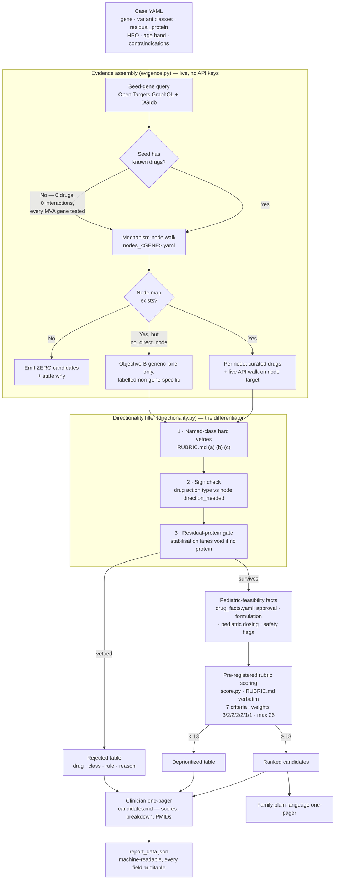

# Track 2 — Drug Repurposing Report

**Rare Disease, Real Kid: The MVA Hackathon 2026**

Team: swoopeagle · Proband: PROBAND01 · Gene: *BUB1B* (MVA type 1)

---

> **These are hypotheses for further investigation. They are not treatment recommendations
> and not medical advice.**
>
> Nothing in this report has been tested in a patient with mosaic variegated aneuploidy. No
> drug named here should be given to any child outside a clinical trial or a physician-
> supervised n-of-1 protocol with ethics approval and informed consent. Candidate rankings
> reflect strength of *mechanistic rationale and feasibility*, not evidence of efficacy —
> there is no efficacy evidence for any of them in this condition.
>
> This analysis used publicly available data and a de-identified research dataset provided
> under the challenge's terms. It is not a clinical report and has not been reviewed by a
> treating clinician.

---

## 1. Executive summary

The proband is a child with clinically confirmed mosaic variegated aneuploidy (MVA). Our
Track 1 analysis identifies a **compound heterozygous genotype in *BUB1B*** (MVA type 1,
MIM 257300), the gene encoding BubR1, a core component of the mitotic spindle assembly
checkpoint (SAC):

| Allele | Change | Consequence | Evidence |
|---|---|---|---|
| 1 | c.2210T>G, p.(Leu737\*) | stop_gained, exon 17/23, NMD-predicted | ClinVar 533901, pathogenic/likely pathogenic, multiple submitters, no conflicts (rs759242053) |
| 2 | c.3006T>G, p.(Asn1002Lys) | missense, **last exon (23/23)**, within the kinase domain | 1 allele in 1,112,006 (gnomAD v4.1); AlphaMissense 0.923, MVP 0.852, REVEL 0.472 |

The two alleles are not merely both damaging — they are **damaging in different ways**, and
that asymmetry is the single most therapeutically consequential fact in this report. The
p.(Leu737\*) allele truncates upstream of the kinase domain (UniProt O60566, residues
766–1050), removing the ATP-binding Lys795 and catalytic Asp882, and is predicted to undergo
nonsense-mediated decay: functionally null. The p.(Asn1002Lys) allele lies in the **final
exon**, where transcripts characteristically **escape NMD**, and is therefore expected to
produce a full-length, if functionally impaired, protein.

**A null allele plus a residual-protein allele is the canonical MVA1 configuration, and it
opens a therapeutic door that a two-null genotype would close.** Interventions that act by
raising the abundance or stability of existing BubR1 protein require protein to exist. In
this child, the evidence suggests it does. We treat this as a *likely but unproven*
inference throughout, and we specify the experiment that would settle it (§4, §6).

**Chosen therapeutic objective.** We adopt a four-part taxonomy of what a repurposing effort
in MVA could be attempting (§2) and select **Objective B — buffering the downstream
consequences of aneuploidy in surviving cells** — as the lead lane, with Objective C (cancer
surveillance and radiation stewardship, §7) as a concurrent, non-pharmacological
recommendation. Objective A (restoring mitotic fidelity) is largely closed: the available
pharmacology in that space *increases* chromosome missegregation, which in a
checkpoint-deficient child is the wrong direction at the wrong dose in the wrong tissue.

**Candidates.** Applying a scoring rubric committed to version control *before* any candidate
was generated (`track2/RUBRIC.md`), the surviving candidates rank as follows:

| Rank | Candidate | Mechanistic node | Objective | Score |
|---|---|---|---|---|
| 1 | Nicotinamide | NAD⁺ → SIRT2 → BubR1 stabilisation | A/B | **21/26** |
| 2 | Nicotinamide riboside | NAD⁺ → SIRT2 → BubR1 stabilisation | A/B | 20/26 |
| 3 | N-acetylcysteine | proteostasis / mitochondrial buffering | B | 19/26 |
| 4= | Idebenone | proteostasis / mitochondrial buffering | B | 17/26 |
| 4= | Metformin | proteostasis / mitochondrial buffering | B | 17/26 |

**The rubric produced a result we did not anticipate and did not argue for.** Nicotinamide
riboside has the more direct mechanistic evidence for the SIRT2→BubR1 axis and wins the
directionality criterion outright (2 versus 1). It nonetheless finishes *second*, because it
is a nutritional supplement with no drug approval in any jurisdiction and no established
paediatric dosing, while plain nicotinamide is an approved medicine with paediatric dosing
guidance and decades of exposure. Because the weights were fixed in advance, this is a
finding rather than a preference: **for a child who would need chronic administration under
physician supervision, the cheaper and more feasible member of the pair is the better
candidate**, and the field's current attention to NR may be leaving the more practical option
underexplored.

**Falsification.** No candidate here is worth pursuing if the residual-protein premise fails.
The gating experiment is a **BubR1 immunoblot on patient-derived fibroblasts**, performed
*before* any drug is administered to anyone; if p.(Asn1002Lys) does not yield detectable
protein, the two top-ranked candidates should be abandoned rather than adjusted. The primary
pharmacodynamic readout for any subsequent n-of-1 protocol is **cytokinesis-block micronucleus
frequency in peripheral lymphocytes** — cheap, quantitative, longitudinally repeatable from a
blood draw, and a direct measure of the disease mechanism rather than a proxy for it (§6).

**Generality.** The analysis above was produced by a pipeline that takes a single YAML case
file — gene, variant classes, residual-protein status, phenotype terms, age band,
contraindications — and requires no code changes to run on a different patient or a different
disease. **This child is instance #1, not a bespoke analysis.** We demonstrate that claim
rather than assert it: run unchanged on a positive-control disorder the pipeline was never
tuned for (ataxia-telangiectasia), it recovers NAD⁺ precursors at ranks 1–2; run on a
scrambled seed gene, it returns nothing at all; and run on a sibling MVA case with a
homozygous nonsense genotype, **the same top-ranked node is automatically vetoed** — same
code, opposite conclusion, driven only by variant class (§9).

---

## 2. The therapeutic objective taxonomy

Most repurposing analyses begin by asking which drugs are associated with a gene. We begin
one step earlier, by asking what a drug would be *for*. In MVA the answer is not obvious, and
the four plausible answers have different targets, different evidence bases, and — critically
— **opposite signs on the same pharmacology**. Naming the objective before naming any drug is
what prevents this report from becoming a ranked list of associations.

| | Objective | Target of intervention | Principal hazard |
|---|---|---|---|
| **A** | Reduce ongoing chromosome missegregation | mitotic fidelity | most agents acting on mitosis *increase* chromosomal instability |
| **B** | **Buffer downstream stress in aneuploid cells** | cell survival, stemness, proteostasis | best-supported and lowest-risk lane; effects are indirect |
| **C** | Cancer chemoprevention and surveillance | tumour initiation and early detection | interventions must not be immunosuppressive |
| **D** | Symptomatic and supportive care | individual organ systems | standard of care, not repurposing |

**Objective A is largely closed, and understanding why is essential.** The intuitive move —
strengthen a failing checkpoint — has almost no tractable pharmacology behind it. The
druggable mitotic targets (MPS1/TTK, Aurora A and B, KIF11/Eg5, CENP-E) are all *inhibitors*,
developed for oncology, and each either further degrades checkpoint function or depends on an
intact checkpoint to kill. In a child whose germline lesion *is* checkpoint insufficiency,
both properties are disqualifying: the first accelerates the disease mechanism, the second
simply fails. This is not a close call, and §5 documents each rejection individually. The one
genuine Objective-A route in this case is indirect — raising the abundance of the residual
BubR1 protein the child still makes — which is why the NAD⁺→SIRT2→BubR1 chain appears at the
top of our list and is best understood as straddling A and B.

**Objective B is the lead lane.** Recent mechanistic work locates much of the developmental
pathology of chromosomal instability not in missegregation itself but in what accumulated
aneuploidy does to a cell afterwards: proteotoxic stress from stoichiometric imbalance,
saturation of autophagy, consequently impaired mitophagy, accumulation of damaged
mitochondria, and reactive oxygen species. In a *Drosophila* neural-stem-cell model of
SAC-depletion-induced microcephaly, brain size was rescued by boosting mitochondrial
chaperones, by scavenging ROS, and by inhibiting TOR signalling (PMID 41820377). Those
rescues are genetic rather than pharmacological, and we are careful not to overstate them —
but they nominate a class of interventions whose *direction of effect is defensible in a
patient*, which is precisely what Objective A lacks.

A second downstream axis is immunological: micronuclei arising from missegregation activate
cytosolic DNA sensing, and single-cell transcriptomics of cells from a patient with
biallelic *MAD1L1* variants showed interferon and NF-κB activation in aneuploid **and
bystander euploid cells** (PMID 36322655). We flag this as mechanistically important and
therapeutically premature: the plausible interventions are immunomodulatory, and Objective C
constrains us against immunosuppression in this population.

**Objective C is real, actionable today, and not pharmacological.** Roughly one third of MVA
patients develop malignancy, characteristically before age five, and *BUB1B* is the
highest-risk subtype. The correct response is a surveillance schedule and a radiation-
stewardship policy, both of which already have published guidance (§7). We include it because
it is the intervention in this report most likely to benefit the child, and because a
repurposing proposal that ignores the dominant near-term risk to the patient is not a serious
clinical document.

**Objective D** — seizure control, growth and endocrine management, orthopaedic and cardiac
care — is standard of care, outside the scope of a repurposing challenge, and mentioned only
so its absence is not mistaken for oversight.

---

## 3. From variant to mechanism

### 3.1 The spindle assembly checkpoint, and where BubR1 sits in it

During mitosis, an unattached kinetochore recruits MPS1/TTK, which phosphorylates the MELT
repeats of KNL1, recruiting BUB3–BUB1. BUB1 in turn scaffolds **BUBR1(BUB1B)–BUB3** and,
together with MAD1–MAD2 at the outer kinetochore, catalyses conversion of open MAD2 to closed
MAD2 bound to CDC20. Closed MAD2–CDC20 and BUBR1–BUB3 assemble the **mitotic checkpoint
complex (MCC)**, a pseudo-substrate inhibitor of the anaphase-promoting complex
(APC/C^CDC20). While the MCC holds, securin and cyclin B1 escape ubiquitylation, separase
remains inhibited, centromeric cohesin is not cleaved, and sister chromatids stay paired.
When the last kinetochore attaches, p31^comet (MAD2L1BP) presents closed MAD2 to the AAA+
ATPase TRIP13, which unfolds it, disassembling the MCC and licensing anaphase.

BubR1 insufficiency breaks this in two places at once, and the doubling matters:

1. **Checkpoint failure.** Insufficient MCC means APC/C^CDC20 is not adequately restrained;
   securin and cyclin B1 are degraded prematurely, separase activates early, and cohesin is
   cleaved before biorientation is achieved. The cytogenetic signature is **premature
   chromatid separation (PCS)**, characteristically in more than half of metaphases in MVA1.
2. **Attachment instability.** Independently of MCC assembly, BubR1 recruits PP2A-B56 to
   kinetochores to stabilise kinetochore–microtubule attachments. Losing this function
   produces erroneous attachments *in addition to* a shortened checkpoint.

The result is random, whole-chromosome missegregation affecting different chromosomes in
different cells — the "variegated" in mosaic variegated aneuploidy. Biallelic *BUB1B*
variants were the first established cause of the syndrome (PMID 15475955).

### 3.2 The disease mechanism is visible in this child's own sequencing data

We regard the following as the strongest single piece of corroboration in this submission,
because it is measured in the proband rather than inferred from the literature. Analysing
B-allele frequency at heterozygous sites across the genome, most chromosomes show the tight
distribution about 0.5 expected of a diploid sample, with 25–28% of sites falling outside a
0.40–0.60 band. Five chromosomes deviate markedly:

| Chromosome | Fraction of heterozygous sites outside 0.40–0.60 |
|---|---|
| Diploid baseline (majority of chromosomes) | 0.25 – 0.28 |
| chr17 | 0.316 |
| chr9 | 0.335 |
| chr20 | 0.389 |
| chr21 | 0.422 |
| chr22 | 0.437 |

Band-splitting of this kind is the expected signature of **mosaic aneuploidy**: in a mixed
population of cells, gains and losses shift allelic ratios away from 0.5 in proportion to the
aneuploid fraction. That the deviation involves *several different chromosomes rather than
one* is the specific hallmark of the variegated pattern. Short chromosomes contribute more
statistical noise, so we present this as corroborative rather than quantitative, and note
that depth-based confirmation requires alignment we have deliberately deferred (§10).

The argument therefore closes on itself: a *BUB1B* genotype predicts checkpoint failure,
checkpoint failure predicts variegated mosaic aneuploidy, and variegated mosaic aneuploidy is
directly observable in this child's sequencing data. Three independent lines — phenotype
match, biallelic genotype, and cytogenetic signature — converge on the same conclusion.

### 3.3 The residual-protein question, which gates everything downstream

The therapeutic relevance of the genotype turns on a single question: **does this child make
any BubR1 protein?**

Interventions that stabilise or raise the level of an existing protein are useless against a
complete absence of that protein. The relevant biology is well established: BubR1 abundance
is rate-limiting for mitotic fidelity, and increasing it reduces aneuploidy and extends
healthy lifespan in mice (PMID 23242215). BubR1 levels are controlled post-translationally by
**SIRT2-mediated deacetylation at K668**, which protects the protein from proteasomal
degradation; SIRT2 overexpression or NAD⁺ repletion raises BubR1 in vivo (PMID 24825348).
Because SIRT2 is an NAD⁺-dependent deacetylase, NAD⁺ availability is an upstream lever on
BubR1 abundance.

That lever requires a substrate. In this patient:

- p.(Leu737\*) sits in exon 17 of 23, well upstream of the last exon–exon junction, and is
  therefore predicted to trigger nonsense-mediated decay — contributing little or no protein.
- p.(Asn1002Lys) sits in the **final exon**, downstream of the last junction, where NMD is
  characteristically not triggered. This allele is expected to be **translated into
  full-length protein** carrying a single amino-acid substitution within the kinase domain.

We therefore assign this genotype a residual-protein status of **likely**, and the
candidate-generation pipeline treats that status as a gating input rather than a footnote
(§8). Two caveats are stated plainly and repeated where they bear on candidate selection.
First, **the in-silico predictors disagree about p.(Asn1002Lys)**: AlphaMissense (0.923) and
MVP (0.852) call it damaging while REVEL (0.472) is close to neutral. We report the
disagreement rather than the most favourable number; it does not affect the residual-protein
inference — an expressed protein remains expressed whether the substitution is mildly or
severely impairing — but it does mean the *degree* of functional impairment is unresolved.
Second, **NMD escape is a prediction, not an observation.** Only a protein-level measurement
in patient cells can confirm it, which is why the BubR1 immunoblot is positioned as the
gating experiment before any therapeutic reasoning is acted upon (§6).

Finally, phase. The two variants lie 10,911 bp apart, beyond the reach of short-read or
read-pair phasing, and no parental samples are available; *trans* configuration is therefore
**inferred, not demonstrated**. The inference rests on grounds independent of phasing: the
diagnosis of MVA is clinically confirmed, MVA1 is autosomal recessive, a single heterozygous
null allele does not cause the disorder, an exhaustive filter-free sweep of *BUB1B* and the
eight other MVA genes found no alternative partner allele, and the phenotype-driven
prioritisation scored the recessive model above the dominant one. Alignment would not resolve
this at 10.9 kb; only parental testing would.

---

## 4. Candidate chains

*These are hypotheses for further investigation. They are not treatment recommendations
and not medical advice. No candidate below has been tested in a patient with mosaic
variegated aneuploidy, and nothing here is a claim of efficacy.*

### 4.0 How to read this section

Five candidates are argued in full. They are the five that cleared the pre-registered
cutoff of 13/26 with a score of 17 or above; everything else the pipeline produced is
either handled in §4.6 (the 15/26 tie) or in the rejected/deprioritized table in §5.

Each candidate is argued as the same five-part chain, in the same order, so that they are
directly comparable rather than merely ranked:

1. **Variant class → protein consequence** — does this child's genotype leave residual
   BubR1 protein for the drug to act on?
2. **Pathway consequence** — what the lesion does downstream, with a primary citation.
3. **Drug → node, with the direction of effect written as an explicit sign** — does the
   drug push the node the way this variant needs it pushed, or the opposite way? This is
   the step most repurposing pipelines skip, and it is the step that kills most of §5.
4. **Pediatric feasibility** — label status, formulation, dosing precedent, the three
   adverse effects that matter most here, and growth/neurodevelopment considerations.
5. **Falsification criterion** — the one experiment that would kill the candidate.

Each chain closes with the candidate's score against `track2/RUBRIC.md`, which was
committed to this repository **before** any candidate was generated. Weights are
C1 directionality ×3, C2 human/model support ×2, C3 approval ×2, C4 pediatric dosing ×2,
C5 chronic-use safety ×2, C6 PD biomarker ×1, C7 falsifiability ×1; maximum 26. Scores
below are the pipeline's output, unedited.

**The genotype that gates everything.** The child is a *BUB1B* compound heterozygote:
`p.(Leu737*)`, a stop_gained variant in exon 17 of 23, predicted to trigger
nonsense-mediated decay, and `p.(Asn1002Lys)`, a missense variant in the final exon. The
NMD rules are standard and well described (Kurosaki, Popp & Maquat, *Nat Rev Mol Cell
Biol* 2019, PMID 30992545): a premature termination codon upstream of the last
exon-exon junction complex is efficiently degraded, while a codon change in the last exon
escapes NMD and is translated. Applied here, allele 1 is expected to contribute little or
no protein, and allele 2 is expected to contribute a full-length protein carrying a single
substitution. That is why the case file records `residual_protein: likely` — and why the
SIRT2/BubR1 stabilization lane, which stabilizes protein that already exists, is offered
at all. **The residual-protein call is an inference from variant position, not a
measurement.** It is unproven without a BubR1 western blot on patient cells. If it is
wrong — if `p.(Asn1002Lys)` is itself destabilizing and the cell makes no appreciable
BubR1 — then candidates 4.1 and 4.2, the two highest-scoring chains in this report,
collapse and only the Objective B buffering lane survives. We restate this at every
chain rather than assert it once, because it is the single assumption that carries the
most weight in this document.

Two further genotype notes carried forward from §3. First, the truncation at Leu737
removes the entire C-terminal kinase domain (UniProt O60566, residues 766–1050), which is
a pseudokinase domain in vertebrates (Suijkerbuijk et al., *Dev Cell* 2012, PMID 22698286)
but is nonetheless structurally required. Second, `p.(Asn1002Lys)` sits *inside* that same
domain, and the two in-silico predictors disagree sharply: REVEL 0.472 versus
AlphaMissense 0.923 (REVEL: Ioannidis et al., *Am J Hum Genet* 2016, PMID 27666373;
AlphaMissense: Cheng et al., *Science* 2023, PMID 37733863). We report the disagreement
rather than picking the predictor that suits the argument. A REVEL score of 0.472 is
squarely in the uninformative band; the entire hypothesis set below is downstream of a
call the tools do not agree on.

---

### 4.1 Nicotinamide — 21/26

**4.1.1 Variant class → protein consequence.** Compound heterozygous truncating +
last-exon missense; residual full-length BubR1 protein **likely but unproven** (§4.0).
This candidate acts on the abundance of existing BubR1 protein, so it is void if the
residual-protein inference is wrong. The pipeline enforces this as a hard gate, not as
prose: the same node was automatically voided in the *MAD2L1BP* sibling case
(`residual_protein: no`) with the message "Node sirt2_bubr1 stabilises existing protein;
case residual_protein=no, so there is nothing to stabilise. Lane void."

**4.1.2 Pathway consequence.** BubR1 protein abundance is rate-limiting for protection
against aneuploidy: transgenic overexpression of BubR1 reduced aneuploidy and tumour
burden and extended healthy lifespan in mice (Baker et al., *Nat Cell Biol* 2013,
PMID 23242215). Abundance is set in part by acetylation state — SIRT2 deacetylates BubR1
at K668, blocking its ubiquitin-mediated degradation, and NAD⁺ precursor supplementation
raised BubR1 levels in vivo (North et al., *EMBO J* 2014, PMID 24825348). The lesion in
this child is a quantitative BubR1 deficit, and the node is a quantitative control point
on the same protein.

**4.1.3 Drug → node, with the sign.** Node `sirt2_bubr1`; **direction needed:
`+` (activate)**. Nicotinamide raises the NAD⁺ pool, NAD⁺ availability increases SIRT2
activity, SIRT2 activity increases BubR1 abundance: **sign `+`, matching the direction the
variant requires.** The honest qualifier is that nicotinamide is one step further from the
node than nicotinamide riboside and is also a product-inhibitor of sirtuins at high
concentration, which is why it scores C1 = 1 ("plausible sign, indirect node") rather than
2. Directionally correct, mechanistically less direct.

**4.1.4 Pediatric feasibility.** *Label status:* an approved medicine for pellagra and
niacin deficiency in multiple regions, and separately available as an OTC vitamin B3
product. *Formulation:* oral tablet/capsule; an oral solution is compoundable for a child
who cannot swallow tablets. *Dosing precedent:* established pediatric dosing guidance
exists for pellagra/B3 deficiency (label-derived; the specific regimen must be taken from
current labelling, not from this report). *Top three adverse effects:* dose-dependent
hepatotoxicity at high chronic doses; nausea/GI upset; headache. Nicotinamide does not
cause the prostaglandin-mediated flushing that limits nicotinic acid. *Growth and
neurodevelopment:* no signal of growth suppression; the relevant monitoring burden is
serial liver function tests. Critically for this patient, nicotinamide is not
immunosuppressive, not genotoxic, and has no mechanism by which it would aggravate
chromosomal instability — which matters in a child carrying roughly a one-in-three risk of
embryonal malignancy before age five (Hanks et al., *Nat Genet* 2004, PMID 15475955).

**4.1.5 Falsification criterion.** Culture patient-derived fibroblasts ± nicotinamide and
blot for BubR1. **If BubR1 protein does not rise, the candidate is dead** — the chain is
built entirely on raising the abundance of a protein that must first be shown to exist and
to be responsive. A second, cheaper falsifier at the phenotype level: cytokinesis-block
micronucleus frequency in patient lymphocytes fails to move on drug.

**Score: 21/26.**

| C | Criterion | Raw | ×W | Justification (pipeline output) |
|---|---|---|---|---|
| 1 | Mechanistic directionality | 1 | 3 | Raises NAD+ upstream of SIRT2→BubR1, but a less direct precursor route than NR; plausible sign, indirect node. |
| 2 | Human genetic / model support | 2 | 4 | Human interventional evidence in the sibling genome-instability pathway (NAD+ augmentation in A-T, PMID 27732836 / 37899683). |
| 3 | Approval status | 1 | 2 | Approved (pellagra) but not for a route/indication specific to a child with MVA. |
| 4 | Pediatric dosing precedent | 2 | 4 | Established pediatric dosing guidance exists. |
| 5 | Chronic-use safety in this context | 2 | 4 | Benign for chronic use with LFT monitoring; not immunosuppressive, not genotoxic, does not aggravate CIN. |
| 6 | Measurable PD biomarker | 2 | 2 | Direct target-engagement (NAD+ level) plus micronucleus-responsive readout. |
| 7 | Falsifiability | 2 | 2 | Patient-fibroblast BubR1 western ± drug specified as the kill experiment. |

---

### 4.2 Nicotinamide riboside — 20/26

**4.2.1 Variant class → protein consequence.** Identical gate to 4.1: residual BubR1
**likely but unproven**. Void if the inference fails.

**4.2.2 Pathway consequence.** Same node and same primary citations as 4.1
(PMID 23242215, PMID 24825348). The additional evidence that distinguishes NR is human
and comes from a sibling genome-instability disorder rather than from MVA: NAD⁺
replenishment improved lifespan and healthspan in ataxia-telangiectasia models via
mitophagy and DNA repair (Fang et al., *Cell Metab* 2016, PMID 27732836), and long-term
nicotinamide riboside use improved coordination and eye movements in patients with
ataxia-telangiectasia (*Mov Disord* 2024, PMID 37899683). That is the exact template shape
this field rewards — gene → pathway → node → cross-species rescue → small human trial —
and it is evidence about the *NAD⁺ arm*, not about MVA.

**4.2.3 Drug → node, with the sign.** Node `sirt2_bubr1`; **direction needed: `+`**. NR is
a direct NAD⁺ precursor entering via nicotinamide riboside kinases; NAD⁺ `+` → SIRT2
activity `+` → BubR1 K668 deacetylation `+` → BubR1 abundance `+`. **Sign `+`, and at the
most direct available point on the node** — this is the one candidate in the report
scoring C1 = 2, "correct sign at a node with direct evidence in the disease pathway."

**4.2.4 Pediatric feasibility.** *Label status:* **not an approved drug anywhere.** NR is
marketed as a GRAS / new-dietary-ingredient supplement (Niagen). This is the whole of its
scoring problem. *Formulation:* oral capsule; capsules can be opened for sprinkle dosing.
*Dosing precedent:* published pediatric use exists in ataxia-telangiectasia cohorts — a
different indication — but there is no established dosing guidance. *Top three adverse
effects:* GI upset; supplement-grade manufacturing/QC variability rather than
pharmaceutical-grade assurance; absence of long-term pediatric safety data (an
uncertainty, listed here deliberately as a risk in its own right). *Growth and
neurodevelopment:* no adverse signal in the A-T cohorts, but those cohorts are small and
short, and no dedicated pediatric growth data exist.

**4.2.5 Falsification criterion.** As 4.1: patient-fibroblast BubR1 western ± NR.
**Falsified if BubR1 does not rise.**

**Score: 20/26.**

| C | Criterion | Raw | ×W | Justification (pipeline output) |
|---|---|---|---|---|
| 1 | Mechanistic directionality | 2 | 6 | Correct sign at a node with direct evidence in the disease pathway: NAD+ → SIRT2 → BubR1 K668 deacetylation → abundance (PMIDs 24825348, 23242215). |
| 2 | Human genetic / model support | 2 | 4 | Human interventional: long-term NR improved coordination/eye movements in A-T (PMID 37899683). |
| 3 | Approval status | 0 | 0 | Not an approved drug in any region. |
| 4 | Pediatric dosing precedent | 1 | 2 | Published pediatric use in another indication; no established dosing guidance. |
| 5 | Chronic-use safety in this context | 2 | 4 | Benign chronic profile in trials to date. |
| 6 | Measurable PD biomarker | 2 | 2 | Direct target-engagement (NAD+) plus micronucleus-responsive readout. |
| 7 | Falsifiability | 2 | 2 | Patient-fibroblast BubR1 western ± NR; falsified if BubR1 does not rise. |

---

> #### Finding 1 — the rubric preferred the cheaper, more feasible molecule
>
> Nicotinamide riboside is the molecule the field is already pursuing on this axis, and on
> the purely mechanistic criterion it beats plain nicotinamide outright: **C1 = 2 versus
> C1 = 1**, a six-point versus three-point contribution, because NR is the more direct
> NAD⁺ precursor with direct evidence at the SIRT2→BubR1 node. On the biology alone, NR
> wins.
>
> It still finishes second, 20/26 to 21/26, and it loses on exactly two criteria:
> **C3 approval (0 vs 1)** — nicotinamide is an approved medicine, NR is an unapproved
> supplement — and **C4 pediatric dosing precedent (1 vs 2)** — nicotinamide has
> established pediatric dosing guidance, NR has published pediatric use but no guidance.
> Four weighted points of deliverability against three weighted points of mechanism.
>
> This inversion was not designed. The weights (C1 ×3, C3 ×2, C4 ×2) were committed in
> `track2/RUBRIC.md` before any candidate existed, precisely so that a result like this
> could not be back-fitted. What the rubric is saying is a specific, useful thing: for a
> child who needs something that can actually be given, prescribed, quality-assured and
> dose-guided today, **the vitamin outranks the supplement that has the better paper
> trail** — and the two sit on the same node, so the mechanistic bet is nearly the same
> bet. A pipeline optimising for mechanistic elegance alone returns NR and stops. This one
> returns a cheaper and more administrable alternative on the same axis, and shows its
> working for why.
>
> The honest counterweight: nicotinamide's C1 = 1 is a real demerit, not a rounding error.
> Nicotinamide is a sirtuin product inhibitor at high concentrations, so the dose-response
> on this node is plausibly non-monotonic. If the falsification experiment in 4.1.5 shows
> BubR1 rising with NR but not with nicotinamide, the ranking should invert and the report
> should be read as having got this one wrong.

---

### 4.3 N-acetylcysteine — 19/26

**4.3.1 Variant class → protein consequence.** Residual protein **likely but unproven** —
but note the difference from 4.1/4.2: this candidate **does not require residual protein**
to be coherent. It targets the consequences of aneuploidy in cells that are already
aneuploid, not the abundance of BubR1. It is the highest-scoring candidate that survives
if the residual-protein inference turns out to be wrong. That robustness is the reason to
carry it even though it scores lower.

**4.3.2 Pathway consequence.** Chromosomal instability causes microcephaly through
proteostasis failure and mitochondrial dysfunction: in a *Drosophila* SAC-depletion model,
CIN-induced microcephaly was driven by proteostatic collapse and mitochondrial dysfunction
and was rescued by restoring mitochondrial and proteostatic homeostasis — Atg1
overexpression, TOR inhibition, Hsp60, and the antioxidant enzymes Sod2 and GTPx-1
(*Nat Commun* 2026, PMID 41820377). This is Objective B — buffering downstream stress in
aneuploid cells — and it is the lane §2 declared as the lead lane.

**4.3.3 Drug → node, with the sign.** Node `proteostasis_mito`; **direction needed:
`+` (restore/activate mitochondrial and proteostatic homeostasis)**. NAC replenishes
glutathione and lowers ROS burden: redox buffering `+`. **Sign `+`.** The qualifier that
holds it to C1 = 1: every rescue in the source paper was **genetic** — Sod2/GTPx-1
overexpression, not a small molecule. NAC is an approved-reach pharmacological stand-in
for a genetically demonstrated rescue, and should be described that way and no more
strongly.

**4.3.4 Pediatric feasibility.** *Label status:* approved in the US and EU (paracetamol
overdose antidote; mucolytic). *Formulation:* oral solution/effervescent and IV, both
routinely used in children. *Dosing precedent:* established weight-based pediatric dosing
guidance exists for both the overdose protocol and mucolytic use — this is one of the
best-characterised pediatric exposures on the list. *Top three adverse effects:* GI upset
and unpalatable taste (the practical adherence problem in a young child); rare
anaphylactoid reactions with IV administration; bronchospasm with inhaled formulations.
*Growth and neurodevelopment:* no growth or neurodevelopmental signal; not
immunosuppressive, not genotoxic, no CIN-aggravating mechanism.

**4.3.5 Falsification criterion.** In-vitro: ROS and mitophagy readouts in patient
fibroblasts ± NAC. **Falsified if patient fibroblasts show no baseline elevation of ROS
or no mitophagy defect** — in that case the axis this candidate buffers is not
demonstrably engaged in this child's cells, and the rationale is imported from a fly model
rather than observed. Note the weaker C7 = 1 here: the kill experiment is in-vitro only,
not a patient-lab measurement.

**Score: 19/26.**

| C | Criterion | Raw | ×W | Justification (pipeline output) |
|---|---|---|---|---|
| 1 | Mechanistic directionality | 1 | 3 | Plausible sign at an indirect node: restores redox/proteostasis buffering in the CIN-microcephaly axis (PMID 41820377); the rescues in that paper were genetic, not pharmacologic. |
| 2 | Human genetic / model support | 1 | 2 | Model-organism rescue only. |
| 3 | Approval status | 2 | 4 | Approved with pediatric-appropriate oral and IV formulations. |
| 4 | Pediatric dosing precedent | 2 | 4 | Established pediatric dosing guidance. |
| 5 | Chronic-use safety in this context | 2 | 4 | Benign for chronic use; not immunosuppressive, not genotoxic, does not aggravate CIN. |
| 6 | Measurable PD biomarker | 1 | 1 | Redox markers are indirect target engagement. |
| 7 | Falsifiability | 1 | 1 | In-vitro: ROS/mitophagy readout in patient fibroblasts. |

---

### 4.4 Idebenone — 17/26

**4.4.1 Variant class → protein consequence.** Residual protein **likely but unproven**;
as in 4.3, this candidate does not depend on the answer. It buffers, it does not stabilize.

**4.4.2 Pathway consequence.** Same axis and same primary citation as 4.3 — mitochondrial
dysfunction as a driver of CIN-induced microcephaly, rescued by restoring mitochondrial
homeostasis (*Nat Commun* 2026, PMID 41820377). Idebenone's distinct claim on this axis is
that it is a short-chain quinone that can accept electrons downstream of a dysfunctional
complex I, so it addresses the mitochondrial half of the axis more directly than a thiol
antioxidant does.

**4.4.3 Drug → node, with the sign.** Node `proteostasis_mito`; **direction needed: `+`**.
Idebenone supports mitochondrial electron flux and lowers ROS: **sign `+`**. Held to
C1 = 1 for the same reason as NAC — a pharmacological stand-in for a genetic rescue — and
with the extra caveat that idebenone's human evidence base sits in a different disease
(Leber hereditary optic neuropathy), not in a chromosomal-instability syndrome.

**4.4.4 Pediatric feasibility.** *Label status:* approved in the EU (Raxone, LHON). *Formulation:*
oral tablet, crushable. *Dosing precedent:* used from age 12 in the LHON label and studied
in pediatric Friedreich ataxia trials; **no established dosing guidance below age 12**,
which is the gap for a young child and the reason C4 = 1 rather than 2. *Top three adverse
effects:* GI upset; reversible chromaturia (harmless but alarming to a family if not
pre-explained); transaminase elevation requiring LFT monitoring. *Growth and
neurodevelopment:* no growth suppression signal; not immunosuppressive; the pediatric
exposure base is smaller than NAC's.

**4.4.5 Falsification criterion.** In-vitro: patient fibroblast respirometry
(Seahorse-type oxygen-consumption profiling) ± idebenone. **Falsified if patient
fibroblasts show no respiratory-chain deficit at baseline**, or if idebenone does not
improve the deficit where one exists.

**Score: 17/26.**

| C | Criterion | Raw | ×W | Justification (pipeline output) |
|---|---|---|---|---|
| 1 | Mechanistic directionality | 1 | 3 | Plausible sign at the mitochondrial-support node; short-chain quinone bypassing complex I. |
| 2 | Human genetic / model support | 1 | 2 | Model-organism/cell evidence in this axis; human evidence is in a different disease. |
| 3 | Approval status | 2 | 4 | Approved (EU) with an oral formulation usable in a child. |
| 4 | Pediatric dosing precedent | 1 | 2 | Published pediatric use, other indication; no established guidance for a young child. |
| 5 | Chronic-use safety in this context | 2 | 4 | Benign chronic profile with LFT monitoring. |
| 6 | Measurable PD biomarker | 1 | 1 | Indirect. |
| 7 | Falsifiability | 1 | 1 | In-vitro only. |

---

### 4.5 Metformin — 17/26

**4.5.1 Variant class → protein consequence.** Residual protein **likely but unproven**;
again not load-bearing for this candidate.

**4.5.2 Pathway consequence.** Same axis, same primary citation (*Nat Commun* 2026,
PMID 41820377). Metformin's route into it is mitochondrial: partial complex I inhibition
shifts the cellular AMP:ATP ratio and activates AMPK, which is a canonical upstream
activator of autophagy/mitophagy and a canonical inhibitor of mTORC1 — the same two
processes (Atg1/autophagy up, TOR down) that rescued the fly model genetically.

**4.5.3 Drug → node, with the sign.** Node `proteostasis_mito`; **direction needed: `+`**.
Metformin raises AMPK activity, which raises autophagic/mitophagic flux and lowers mTORC1
signalling: **sign `+` on the proteostasis node** (and incidentally `−` on mTORC1, which is
also the direction the `mtorc1` node wants). Scored C1 = 1, indirect.

**4.5.4 Pediatric feasibility.** *Label status:* approved worldwide for type 2 diabetes.
*Formulation:* oral solution and tablets; the solution suits a young child. *Dosing
precedent:* established pediatric dosing guidance from age 10 for T2D, with published use
in younger children in other indications. *Top three adverse effects:* GI intolerance
(the dominant real-world problem, dose-limiting and often adherence-limiting); vitamin B12
depletion on chronic use, which requires periodic B12 monitoring and matters more in a
child with growth and neurodevelopmental vulnerability than in an adult; lactic acidosis
(rare, and a specific hazard in intercurrent illness with dehydration or hypoxia — not a
trivial consideration in a child with recurrent illness). *Growth and neurodevelopment:*
metformin reduces appetite and weight in some children; in a child already at risk of poor
growth this is a direct and unwelcome interaction with the phenotype, and would need
explicit growth-velocity monitoring as a stopping rule.

**4.5.5 Falsification criterion.** In-vitro: **patient-fibroblast viability dose-response
curve versus a euploid control line.** If patient (mosaically aneuploid) cells show
*greater* sensitivity to metformin than control cells at achievable exposures, the drug is
behaving as an aneuploidy-selective agent in this child's own tissue and must be dropped
under the same veto (c) that removed AICAR. This is not a formality — see below.

**Score: 17/26.**

| C | Criterion | Raw | ×W | Justification (pipeline output) |
|---|---|---|---|---|
| 1 | Mechanistic directionality | 1 | 3 | Plausible sign, indirect: mitochondrial/AMPK-linked buffering in the proteostasis axis. |
| 2 | Human genetic / model support | 1 | 2 | Model-organism evidence only in this axis. |
| 3 | Approval status | 2 | 4 | Approved with a pediatric oral solution. |
| 4 | Pediatric dosing precedent | 2 | 4 | Established pediatric dosing guidance. |
| 5 | Chronic-use safety in this context | 1 | 2 | Tolerable with monitoring; B12 depletion on chronic use, plus the unresolved AMPK/AICAR tension above. |
| 6 | Measurable PD biomarker | 1 | 1 | Indirect target engagement. |
| 7 | Falsifiability | 1 | 1 | In-vitro: patient-fibroblast viability curve to test the aneuploidy-selectivity concern. |

#### 4.5.6 The metformin–AICAR tension, stated in the open

The pre-registered rubric contains a hard veto (c): *aneuploidy-selective lethality as
chronic systemic therapy*. That veto exists because compounds that preferentially kill
aneuploid cells — AICAR, 17-AAG, chloroquine (Tang et al., *Cell* 2011, PMID 21315436) —
are pointed at the wrong target in this patient. Her own somatic tissue is mosaically
aneuploid. As chronic systemic therapy, an aneuploidy-selective agent is self-directed
cytotoxicity. The pipeline hard-vetoes AICAR on that basis and never scores it.

**AICAR is a direct AMPK activator. Metformin is an AMPK activator too.** If AMPK
activation is the reason AICAR is aneuploidy-selective, then metformin is a weaker version
of a vetoed mechanism, and the report has kept a candidate it should have killed. We think
this is the sharpest internal objection to §4, so we state it rather than leaving it in a
YAML comment.

The case for keeping metformin: (i) AICAR is a direct AMP-mimetic that activates AMPK
allosterically and reaches high intracellular AMP-mimetic concentrations, whereas
metformin at clinical exposures activates AMPK indirectly and far more weakly, downstream
of partial complex I inhibition; (ii) the aneuploidy-selective phenotype reported for
AICAR was not reported for metformin in the same screen, and metformin has decades of
chronic human exposure — including in children — without an aneuploidy-selective toxicity
signal; (iii) the node metformin is scored against here is proteostasis/mitophagy support,
not cytotoxicity. The pipeline therefore does not veto it, and instead penalises it at
**C5 = 1** rather than 2.

The case against: point (i) is a quantitative argument about exposure that we have not
measured in this child's cells, and quantitative arguments of that shape are exactly how
wrong-sign candidates survive into reports. If the mechanism is on a continuum, "weaker"
is a dose statement, not a safety statement.

**We resolve it by test, not by argument.** The falsification criterion in 4.5.5 is the
resolution: run patient fibroblasts and a euploid control line against a metformin
dose-response curve. If the patient's mosaically aneuploid cells are selectively
sensitive, metformin inherits veto (c) and leaves the report. Until that experiment is
run, metformin should be read as the *least* secure of the five chains, notwithstanding
its 17/26.

---

### 4.6 The 15/26 tie: sirolimus, everolimus and dasatinib

Three drugs tie at **15/26** — above the cutoff of 13, below the five chains above — and
they tie for the same reason. All three score **C5 = 0**, the pre-registered floor for
"immunosuppressive/genotoxic or CIN-aggravating" chronic use. C5 is weighted ×2, so a zero
there costs four weighted points and moves a candidate from the top of the list to the
middle of it. This is the second finding we want a judge to see, because the rubric
converted a safety judgement into an arithmetic one and the arithmetic held.

**The real case for them — which is strong, and stronger than for anything in §4.3–4.5.**

*mTOR (sirolimus, everolimus).* BubR1-insufficient tissue shows hyperactive mTORC1: Sieben
et al. demonstrated hyperactive mTORC1 signalling in skeletal muscle in the BubR1 allelic
series (*J Clin Invest* 2020;130(1):171–188, PMID 31738183,
[jci.org/articles/view/126863](https://www.jci.org/articles/view/126863)). Independently,
**TOR inhibition was one of the rescues of CIN-induced microcephaly** in the *Drosophila*
proteostasis model (PMID 41820377). That is two independent lines pointing at one node,
one of them in the correct gene. No other node in this report has that.

*Senolytics (dasatinib).* The **BubR1^H/H progeroid mouse is the founding experiment of
the entire senolytics field**: clearance of p16^Ink4a-positive senescent cells delayed
ageing-associated disorders in that exact genotype (Baker et al., *Nature* 2011,
PMID 22048312). If any drug class has a claim to being "designed for" a BubR1 hypomorph, it
is this one, and the genotype match is closer than for any other candidate here.

**The case against, which is why they are not in §4.1–4.5.**

This child carries roughly a one-in-three risk of embryonal malignancy — Wilms tumour,
rhabdomyosarcoma, ALL — before age five (PMID 15475955), and MVA1 children are also
infection-prone. Sirolimus and everolimus are immunosuppressants. Chronic
immunosuppression in a child whose principal survival threat is early malignancy runs
directly against Objective C (cancer chemoprevention and surveillance) declared in §2 —
one lane's candidate actively undermining another lane's objective. Dasatinib is worse on
this axis, not better: myelosuppressive, immunosuppressive, and with documented
growth-plate effects in children, in a child with growth failure as part of the phenotype.
Intermittent dosing is the standard safety argument for senolytics, and it is a real
argument, but senescent-cell clearance during active neurodevelopment is unstudied — we
could not find data either way, and "unstudied" in a young child is a reason for a zero,
not a reason for a one.

Two further demerits are worth naming. Both mTOR candidates score **C2 = 1**: the
*Drosophila* rescue is a model-organism result, and while the Sieben mTORC1 observation is
human-gene-relevant it is a mouse allelic series, so a direct BubR1→mTORC1 causal link in
human patient tissue remains unverified. And both score **C1 = 1**, because mTORC1 is a
downstream consequence node, not the mitotic lesion.

**Disposition.** Not rejected, and deliberately not deleted. These are second-line,
biomarker-gated candidates: if the NAD⁺ lane is falsified by the western in 4.1.5 and the
buffering lane is falsified by the fibroblast work in 4.3.5, the mTOR node is the
best-evidenced thing left standing, and a low-dose, intermittent, p-S6-gated protocol
under an ethics-approved n-of-1 framework is the form in which it would have to be
considered — with the immunosuppression objection stated to the family first, not last.
Their falsification criteria are correspondingly weak (C7 = 1, in-vitro p-S6 suppression
in patient fibroblasts, or in-vitro senescent-cell clearance), which is itself part of why
they sit below the leading five.

---

### 4.7 What the ranking is and is not

The five chains above are ranked by strength of *mechanistic rationale and pediatric
feasibility*. **No candidate here has efficacy evidence in mosaic variegated aneuploidy,
because no candidate has been tested in mosaic variegated aneuploidy.** The literature on
this condition is pre-therapeutic: the 2024 *Nature Reviews Genetics* review of MVA in
development, ageing and cancer (PMID 39169218) contains no therapeutic section, and the
only interventions reported in MVA1 patients are standard oncology, surveillance, and a
single haematopoietic stem-cell transplant. A ranking of untested hypotheses is a research
agenda, not a treatment plan, and §6 exists because a hypothesis without a readout is
worth nothing.

## 5. Rejected and deprioritized hypotheses

*This section was written before §4 was finalised. The rejects discipline the shortlist:
in a condition where the seed gene returns zero approved drugs from every database we
queried, the informative work is not producing a list — any knowledge-graph ranker will
produce a list — it is deciding, with a stated reason, what must not be on it.*

Three classes of decision are reported here, and they are not the same kind of decision:

- **Hard veto** — the candidate was assembled by the pipeline and then removed by the
  directionality filter *before scoring*, under one of the three vetoes pre-registered in
  `track2/RUBRIC.md`: (a) mechanism increases chromosome missegregation; (b) efficacy
  depends on an intact spindle assembly checkpoint; (c) aneuploidy-selective lethality as
  chronic systemic therapy. A vetoed candidate never receives a score, however well it
  would have scored.
- **Below cutoff** — scored against the rubric and finished under 13/26.
- **Not scored** — surfaced by the live API walk with no curated facts, and left unscored
  rather than guessed.

### 5.1 The rejected table

| Hypothesis | Class / node | Disposition | Why it was killed |
|---|---|---|---|
| **BAY-1161909**, **BAY-1217389** | Mps1/TTK inhibitors, node `sac_kinase_mps1` | **Hard veto (a) + (b)** — surfaced live from Open Targets, then removed before scoring | The pipeline was made to find these. MPS1 is the apex SAC kinase directly upstream of BubR1 (PMID 39169218), so an honest mechanism walk *must* surface it — the `sac_kinase_mps1` node is in `nodes_BUB1B.yaml` as a deliberate probe, with its drug list populated live rather than hand-written. Both compounds duly appeared (Phase 1, "Dual specificity protein kinase TTK inhibitor") and both were vetoed: further inhibiting the apex SAC kinase in a patient whose SAC is *already germline-deficient* increases missegregation (veto a) and presumes checkpoint competence she does not have (veto b). This is negative control (b) from the pre-registered list, and it passed. |
| **Aurora kinase inhibitors** (alisertib, barasertib, danusertib, tozasertib, MLN8054, chiauranib) | Aurora A/B, mitotic fidelity | **Hard veto (a)** | Aurora A/B inhibition degrades kinetochore–microtubule error correction and increases chromosome missegregation. In a child whose entire pathology is missegregation, this is the wrong sign at the correct node — the most seductive failure mode in this disease, because a naive network walk scores "mitotic kinase in the SAC neighbourhood" as a hit. |
| **KIF11/KSP inhibitors** (ispinesib, filanesib, litronesib, SB-743921) | Kinesin spindle protein | **Hard veto (a) + (b)** | Monopolar-spindle agents kill via SAC-dependent mitotic arrest. Germline SAC-deficient cells escape the arrest and exit mitosis with massive missegregation instead — the drug's cytotoxic mechanism is disabled and its mutagenic side is not. |
| **Taxanes and vinca alkaloids** (paclitaxel, docetaxel, cabazitaxel, vincristine, vinblastine, vinorelbine, eribulin) | Microtubule-targeting agents | **Hard veto (a) + (b)** | Two independent failures. *Wrong lesion:* increased microtubule assembly rates drive CIN in the colorectal-cancer setting where low-dose taxol was proposed as a corrective (Ertych et al., *Nat Cell Biol* 2014, PMID 24976383); this child's lesion is checkpoint failure, not microtubule hyper-stability, so the mechanism is real but pointed at a different defect. *Wrong dependency:* these agents require an intact SAC to arrest, which is precisely what she lacks. Note this is a veto of the *hypothesis*, not clinical guidance — vincristine and related agents remain part of standard oncology protocols should a malignancy arise, and that decision belongs to a treating oncologist, not to this report. |
| **Low-dose taxanes as a CIN-normalising strategy** | Microtubule dynamics | **Hard veto (a) + (b)**, same rule | Called out separately because it is the plausible-sounding version. The published rationale — restoring normal microtubule assembly rates to reduce missegregation (PMID 24976383; and the same logic in later work) — is sound biology in the cells it was developed in. It is a mechanism for *hyperstable microtubules*, not for a hypomorphic checkpoint kinase, and applying it here would be lesion-matching by keyword. |
| **AICAR / acadesine, 17-AAG / tanespimycin, chloroquine and hydroxychloroquine, HSP90 inhibitors** | Aneuploidy-selective compounds | **Hard veto (c)** | These kill aneuploid cells preferentially (Tang et al., *Cell* 2011, PMID 21315436). The patient's *own somatic tissue* is mosaically aneuploid, so as chronic systemic therapy this is self-directed cytotoxicity against the very cells that constitute her body. The sign is inverted relative to the intent: an agent developed to exploit aneuploidy in a tumour becomes an agent that attacks the patient in a constitutional aneuploidy syndrome. Rational only as *tumour-directed* therapy, in which case it is oncology, not repurposing. See §4.5.6 for the metformin tension this veto creates and how we propose to resolve it. |
| **TRIP13 inhibitors** (DCZ0415) | TRIP13 / MCC disassembly | **Hard veto (a)**, plus unapproved | Wrong direction of effect, and a clean example of the LoF/GoF error the directionality filter exists to catch. MVA *TRIP13* alleles are complete loss-of-function; TRIP13 inhibitors were developed against TRIP13 **over**expression in cancer. Inhibiting TRIP13 further reduces MCC disassembly capacity and worsens mitotic error. A pipeline that matches on gene symbol alone will propose a TRIP13 inhibitor for a TRIP13 patient and be exactly backwards. DCZ0415 is also unapproved, so it would have failed C3 even if the sign had been right. |
| **Reversine; PLK4 inhibitors (centrinone)** | SAC-abrogating tool compounds | **Hard veto (a) + (b)** | Directly abrogate checkpoint signalling or centriole duplication. These are tool compounds for *inducing* the phenotype this child has. |
| **INDOXIMOD** | node `mtorc1` | **Hard veto — wrong sign**, caught live | Not on any hand-written blocklist. The `mtorc1` node requires inhibition; Open Targets annotates indoximod as an **ACTIVATOR** of mTORC1, and the sign check removed it on the API's own annotation. We report this because it is evidence that the directionality filter does real work rather than restating a blocklist we wrote ourselves. |
| **Fisetin** | Senolytics, node `senescence` | **Below cutoff — 11/26** | Scored, and failed. Fisetin is the lower-risk senolytic stand-in for dasatinib + quercetin and it scores well on chronic safety (C5 = 2, benign at intermittent supplement doses), but it takes a **zero on C3 (not approved anywhere)** and a **zero on C4 (no pediatric dosing precedent published)** — eight weighted points lost on deliverability alone — and its evidence is mouse/cell only (C2 = 1). 11 < 13, so it is reported here rather than in §4. |
| **Quercetin (13/26), Coenzyme Q10 (13/26)** | `senescence`, `proteostasis_mito` | **At cutoff — carried but not argued** | Both land exactly on the 13/26 line, both for the same reason as fisetin: C3 = 0, unapproved supplements with no therapeutic pediatric dosing precedent. CoQ10 is the supplement analogue of idebenone (§4.4), which is EU-approved and therefore scores four points higher on approval; quercetin is dasatinib's senolytic partner and inherits the senescence node's unstudied-in-neurodevelopment problem without dasatinib's approval status. Neither earned a five-part chain. |
| **Navitoclax** | Senolytics | **Excluded at curation** | Excluded before it reached the pipeline, on thrombocytopenia — a dose-limiting, mechanism-based toxicity that is unacceptable in a child with marrow vulnerability and MDS risk. Recorded here so the exclusion is visible rather than silent. |
| **KIF18A inhibitors** | CIN-synthetic-lethal | **Out of scope, not vetoed** | Conceptually the most interesting class for MVA-*associated tumours*: KIF18A is dispensable in diploid cells and required in chromosomally unstable ones. That is the same aneuploidy-selective logic as veto (c), so it must not be chronic systemic therapy in a patient whose normal tissue is aneuploid — but unlike AICAR it is worth naming as a *tumour-directed* option for an oncologist to consider if a malignancy arises. It is not a repurposing candidate for this child today and was not scored. |
| **25 mTOR-pathway analogues from the live API walk** | node `mtorc1` | **Not scored — deliberately** | APITOLISIB, AZD-8055, BGT-226, CC-115, DACTOLISIB, DS-3078A, DS-7423, GEDATOLISIB, OMIPALISIB, ONATASERTIB, OSI-027, PALOMID-529, PANULISIB, PERHEXILINE, PERHEXILINE MALEATE, PF-04691502, PKI-179, RG-7603, RIDAFOROLIMUS, SAMOTOLISIB, SAPANISERTIB, SF-1126, VISTUSERTIB, VOXTALISIB, VS-5584. All surfaced from Open Targets on the mTOR node with the correct sign (INHIBITOR), and all were left **unscored** because `drug_facts.yaml` contains no curated approval, formulation, pediatric-dosing or safety facts for them. Scoring them would have meant guessing four of seven criteria per drug. A 35-candidate table would have looked more impressive and been worth less; the full list with ChEMBL IDs and development stages is in `track2/out/mva-child-01/report_data.json`. Several are Phase 1/2 oncology agents that would in any case fail C3 and C4 for a young child. |

### 5.2 What the rejects cost, and what they bought

Of the drugs the pipeline assembled for this case, **three were vetoed before scoring**
(two Mps1/TTK inhibitors on rules a+b, one wrong-sign mTORC1 activator), **one was scored
and fell below cutoff** (fisetin, 11/26), and **25 were left unscored for want of curated
facts**. The class vetoes in `directionality.py` — Aurora, KIF11/KSP, taxanes/vincas,
aneuploidy-selective compounds, TRIP13 inhibitors, SAC-abrogating tool compounds — are
pre-registered patterns that did not fire on this particular assembly because those drugs
were not proposed for these nodes; they are listed above with their reasons because they
are the traps this disease sets, and a reader is entitled to know they were armed before
the run rather than added after it. The filter's self-test (`directionality.py`
`_selftest`) asserts that paclitaxel and AICAR are caught, so the rules are executable and
tested, not decorative.

The pattern across the whole table is one idea: **in mosaic variegated aneuploidy, the
drugs a naive network walk ranks highest are the drugs that are most dangerous.** Mitotic
kinase inhibitors sit one edge from BubR1 in every interaction database. Aneuploidy-
selective compounds match the disease on its single most distinctive feature. Antimitotics
are the standard-of-care neighbours in the oncology literature that dominates this gene's
citation graph. Every one of them is either the wrong sign, the wrong lesion, the wrong
dependency, or aimed at the patient's own tissue. A ranker that does not know which way a
variant broke a protein will surface all of them, confidently, near the top. That is the
argument for the directionality filter in §8, and §5 is the evidence that it does
something.

---

## 6. Biomarker and n-of-1 design

A repurposing hypothesis without a readout is an opinion. This section specifies what would be
measured, when, and what result would end each hypothesis. Nothing here is a proposal to dose
this child; it is the protocol skeleton a treating team and an ethics committee would need
before that question could even be asked.

### 6.1 Primary pharmacodynamic marker

**Cytokinesis-block micronucleus (CBMN) frequency in peripheral blood lymphocytes**, scored per
the cytome protocol (Fenech, *Nat Protoc* 2007, PMID 17546000) and the assay design codified as
OECD Test Guideline 487 (*In Vitro Mammalian Cell Micronucleus Test*, OECD 2023).

It is the primary marker for four reasons, and each one is a property the alternatives lack:

| Property | Why it matters here |
|---|---|
| Measures the disease mechanism directly | A micronucleus is a chromosome or fragment that missed the daughter nucleus — the physical residue of the missegregation event that biallelic *BUB1B* hypomorphism causes. It is not a surrogate for the lesion; it is the lesion, counted. |
| Quantitative and continuous | Reported as micronucleated binucleate cells per 1,000 BN cells. A per-subject time series supports within-patient trend analysis rather than a responder/non-responder dichotomy. |
| Externally validated and standardised | OECD TG 487 and the HUMN international scoring criteria fix the counting rules, so a value is comparable across labs and across time. |
| Cheap and longitudinal from a blood draw | A few millilitres of whole blood; no imaging, no sedation, no ionising radiation (see §7). Repeatable at the frequency a multiple-baseline design requires. |

**Co-primary: % aneuploid metaphases** by conventional karyotype on PHA-stimulated lymphocytes,
with FISH for the chromosomes most often involved in this patient's own baseline karyotypes as a
higher-throughput confirmation. Karyotype is the diagnostic substrate of MVA itself (≥25% of
cells aneuploid across multiple chromosomes is the defining criterion), so the co-primary is
simply the diagnostic measure used as an outcome. The two markers fail differently — CBMN
reports events in cycling cells over one division, aneuploid-metaphase fraction reports the
standing burden — and a candidate that moved one without the other would be informative rather
than confusing.

Neither marker has ever been used as a treatment-response endpoint in MVA, because no treatment
has ever been trialled in MVA (§10). Their performance characteristics in this population —
within-subject coefficient of variation, drift with age, effect of intercurrent illness — are
unknown and would have to be established by the baseline phase itself, not assumed.

### 6.2 Secondary markers: target engagement

Target engagement is measured separately from disease effect. A candidate that does not engage
its node is a dosing failure, not a mechanism failure, and the two must not be confused when the
result is negative.

| Lane | Target-engagement marker | Interpretation |
|---|---|---|
| NAD⁺ precursors (nicotinamide, nicotinamide riboside) | Whole-blood NAD⁺ (LC-MS/MS), pre-dose and at steady state | The A-T trials used blood NAD⁺ as the exposure readout (PMID 27732836, 37899683). No rise = no engagement; the hypothesis is untested, not refuted. |
| mTOR agents (sirolimus, everolimus) | Phospho-S6 (Ser235/236) in PBMC by flow cytometry, plus drug trough concentration | Trough-guided dosing is the established pediatric practice; p-S6 adds a pathway-level confirmation that the trough is doing something. |
| Senolytics (dasatinib + quercetin, fisetin) | p16^INK4a transcript and a SASP panel (IL-6, IL-8, GDF15, MMP3) in PBMC or serum | Senescent-cell burden is the intended target; the BubR1^H/H mouse is the genotype in which senescent-cell clearance was first shown to delay age-associated pathology (PMID 22048312). |

### 6.3 The baseline measurement that gates the lead candidate

**Patient-fibroblast BubR1 western blot, performed before any child is dosed.**

The lead lane (NAD⁺ → SIRT2 → BubR1 K668 deacetylation → BubR1 abundance; PMID 24825348,
23242215) is a *stabilisation* lane. It can only work on protein that exists. This child's
genotype is a *stop_gained* allele in trans with a novel missense allele, so residual protein is
**likely but unproven** (§3, §10). The pipeline encodes exactly this dependency — the lane is
automatically voided for a case whose `residual_protein` field is `no` (§9, gate control) — but
the field value for this child is an inference from variant class, not a measurement.

The measurement is ordinary: patient dermal fibroblasts (or EBV-LCLs), BubR1 immunoblot against
sex- and passage-matched controls, quantified against a loading control, ideally repeated with a
second antibody epitope N-terminal and C-terminal to the truncation site so that a truncated
product is distinguished from absence of product. A parallel ± nicotinamide riboside arm on the
same cells tests whether abundance is *responsive*, not merely present.

Two results, two consequences:

- **No detectable BubR1** → the SIRT2/BubR1 lane is void for this patient regardless of its
  rubric score, and the ranking collapses to the Objective-B buffering lane.
- **BubR1 present but not raised by NAD⁺ precursor exposure ex vivo** → the lane is not falsified
  in principle but has failed its cheapest test, and should not proceed to an in-patient protocol
  ahead of that being understood.

This ordering — the functional test before the exposure, not after it — is the single most
important design commitment in this section.

### 6.4 Clinical outcome measures

Biomarkers are the mechanism check; these are what actually matters to the family.

- **Head circumference (OFC) and growth velocity**, expressed as z-scores against WHO/CDC
  standards, plotted as serial velocity rather than single points. Microcephaly is a cardinal
  feature of MVA1; a change in *velocity* is detectable long before a change in centile.
- **Developmental assessment** on an age-appropriate standardised instrument (Bayley Scales of
  Infant and Toddler Development, or Vineland Adaptive Behavior Scales where a parent-report
  measure is more practical for repeated administration), administered by the same assessor where
  possible.
- **Seizure diary**, family-maintained, with a pre-agreed counting rule for event types, plus
  any existing EEG schedule.
- Family-nominated function goals (feeding, sleep, sitting/walking milestones) recorded as
  written targets at baseline, so that "better" is defined by the family before the first dose
  rather than reconstructed afterwards.

Clinical measures in a single child over months are **not** efficacy endpoints. They are safety
and plausibility context, and they are the measures a family will judge by regardless of what a
protocol says, which is a reason to collect them properly rather than a reason to omit them.

### 6.5 Safety monitoring

- **Renal ultrasound on the surveillance schedule of §7 (q3 months, birth to age 7)** — this is
  standard of care for the genotype and is *not* contingent on any research protocol. It is
  listed here because any n-of-1 protocol must not disturb it, and because any candidate that
  would compromise tumour surveillance or immune competence (sirolimus, everolimus, dasatinib)
  must be weighed against it explicitly.
- **Lane-specific laboratory monitoring:** LFTs for nicotinamide at sustained high dose;
  full blood count and drug trough for mTOR agents; full blood count with platelets for any
  senolytic exposure (navitoclax excluded outright for thrombocytopenia).
- **Exploratory: cell-free DNA.** A serial plasma cfDNA copy-number profile is proposed as an
  exploratory measure only — as a possible early signal of clonal or neoplastic change, and as a
  possible non-invasive proxy for systemic aneuploidy burden. There is no validated cfDNA
  endpoint in MVA, no established sensitivity for the tumour types in question at the relevant
  size, and no basis for acting on a cfDNA result in isolation. It is recorded, not acted on.

### 6.6 Design: multiple-baseline n-of-1 with blinded washout

The design is a **multiple-baseline single-case experimental design**, reported to the CONSORT
Extension for N-of-1 Trials (CENT 2015, PMID 25976398).

```
Phase:   A1 (baseline)      B1 (agent)     A2 (washout)    B2 (agent)      A3
CBMN:    ●   ●   ●   ●      ●   ●   ●      ●   ●   ●       ●   ●   ●      ●   ●
NAD+:    ●   ●                  ●   ●          ●   ●           ●   ●      ●
Clinical:    ●———————————————————————————— continuous ————————————————————————
             (OFC/growth velocity, developmental scale, seizure diary)
```

Design commitments:

1. **Extended baseline first (A1).** At least three, preferably four, CBMN measurements before
   any exposure, spaced to characterise this child's own within-subject variability. Without
   that, no post-exposure value is interpretable.
2. **One agent at a time.** Combination exposure destroys attribution in a single subject.
3. **Blinded washout where the PD marker is reversible.** Whole-blood NAD⁺ falls back after
   withdrawal, so the NAD⁺ lane supports an A-B-A-B structure with the assessor blinded to phase
   and the specimens scored in randomised, de-identified batch order. Micronucleus scoring is
   observer-dependent and must be blinded even when phase assignment is not concealable from the
   family.
4. **Randomised, blinded specimen scoring throughout**, including baseline specimens, so the
   scorer cannot drift with expectation.
5. **Pre-specified stopping rules** for adverse events and for futility (no target engagement at
   maximum tolerated exposure).
6. **Pre-registration** of the analysis plan, marker definitions, and phase lengths before the
   first specimen is drawn.

Withdrawal-reversibility is *not* available for every lane. Senescent-cell clearance is not
expected to reverse on a washout timescale, so a senolytic lane cannot use an A-B-A-B structure
and would be restricted to a multiple-baseline-across-markers design with correspondingly weaker
inference. Stating which lanes support which design is part of the design.

### 6.7 What a single n-of-1 can and cannot establish

**It can establish:**

- Whether the agent engaged its target in *this* patient (NAD⁺ rose; p-S6 fell).
- Whether the agent was tolerated in *this* patient, on *these* laboratory measures, over *this*
  duration.
- Whether the primary PD marker moved in *this* patient beyond that patient's own documented
  baseline variability, with repetition across A-B-A-B phases raising confidence that the
  movement tracks exposure.
- **Falsification.** A negative result at confirmed target engagement is strong evidence
  *against* the mechanistic chain as written — the asymmetry of single-case work runs in the
  direction of killing hypotheses, and that is what it should be used for.

**It cannot establish:**

- Efficacy. Not for this child, not for anyone. A single subject cannot separate treatment effect
  from natural history, regression to the mean, developmental trajectory, concurrent care
  changes, or placebo/expectancy effects on any parent-reported measure.
- Generalisability to other *BUB1B* patients, whose allele combinations and residual protein
  differ, or to other MVA genes.
- Safety in any general sense. Absence of an adverse event in one child over months is not a
  safety profile.
- A dose-response relationship, from a two-level exposure design.

Anyone reading a positive n-of-1 result as evidence of efficacy has misread it, and the report
of such a result should be written so that the misreading is difficult.

### 6.8 Registry aggregation — the proposal

The honest conclusion of §6.7 is that single cases do not settle anything on their own. They can,
however, be **designed to aggregate**, and that is the point of specifying markers this
concretely.

There is no MVA natural-history cohort published since 2008 and no GeneReviews chapter for the
condition (§7), which means that even the *untreated* trajectory of micronucleus frequency and
aneuploid-metaphase fraction with age is unknown. That gap makes every n-of-1 harder to interpret
and is fixable without any intervention at all.

The proposal is a minimal, federated **MVA natural-history and n-of-1 registry**, whose data
model is released with this work (§11):

| Table | Contents |
|---|---|
| `subject` | Pseudonymous ID, gene, variant classes (HGVS, ClinVar class), residual-protein status and how determined, sex, consent scope. |
| `assessment` | Date, age at assessment, CBMN per 1,000 BN cells with scorer ID and blinding status, % aneuploid metaphases and cells scored, OFC/height/weight z-scores, developmental instrument and score. |
| `exposure` | Agent, dose, route, start/stop, phase label (A1/B1/…), blinding, target-engagement marker and value. |
| `event` | Malignancy (type, age, laterality), surgery, seizure-burden change, infection requiring admission, death. |
| `provenance` | Site, protocol/ethics reference, assay platform, scoring guideline version. |

Two design rules make it usable rather than aspirational: **prospective common markers** (any
site can run CBMN and a karyotype), and **untreated subjects are first-class records** — the
natural-history arm is the registry's primary product, and the n-of-1 arm rides on top of it.
With even a dozen subjects contributing serial CBMN, a future n-of-1 gains what this one lacks:
an external expectation for what the marker does when nothing is done.

The registry data model is offered to the MVA Society and to the clinical groups already holding
these patients (§11). We are not proposing to run it.

---

## 7. Surveillance and radiation stewardship

This section contains no repurposing hypothesis. It is the part of the answer that is already
established, already actionable, and costs nothing — and it is included because a report that
proposes untested candidates while omitting the published standard of care for the same genotype
has its priorities backwards.

### 7.1 The published guidance

The current recommendations come from the **Second International Childhood Cancer Predisposition
Workshop** and are published as *Update on Recommendations for Cancer Screening and Surveillance
in Children with Genomic Instability Disorders*, **Clin Cancer Res 2024** (PMID 39264246,
PMC11705613). For mosaic variegated aneuploidy the recommendations are:

| Recommendation | Detail |
|---|---|
| **Renal ultrasound every 3 months, from birth to age 7** | Applies to **all** children with a clinical MVA diagnosis, **including the genetically unsolved**. Targets Wilms tumour, whose incidence in this population is concentrated in the first years of life. |
| **Regular clinical assessment with review of systems for rhabdomyosarcoma** | Clinical examination and symptom review at scheduled visits, rather than a specific imaging protocol. |
| **Avoid radiation exposure** | Explicit in the guidance for genomic instability disorders. |
| **HPV vaccination** | Recommended, per the general guidance for this class of disorders. |

The same document is explicit that **convincing evidence of childhood cancer risk in MVA is
established only for *BUB1B* (MVA1) and *TRIP13* (MVA3)** — the two subtypes with core spindle
assembly checkpoint failure. This is the same organising rule that runs through §2 and §3: depth
of SAC failure tracks embryonal cancer risk, and centrosomal (*CEP57*) or spliceosomal
(*CENATAC*) subtypes have not shown the same tumour burden.

### 7.2 Why this matters specifically for this child

**This child is *BUB1B* compound heterozygous — the highest-risk subtype in the guidance.**

Across published MVA1 cases, malignancy has been reported in **12 of 31 (38.7%)** in the most
recent systematic reappraisal (Pavone et al., *Neurol Sci* 2022, PMID 35804254; cases spanning
1988-2018), with onset
almost always before age 5. The reported spectrum is embryonal and haematological:

- **Wilms tumour** (nephroblastoma) — the reason the renal ultrasound schedule exists;
- **rhabdomyosarcoma** — the reason for the review-of-systems recommendation;
- **acute lymphoblastic leukaemia**;
- **myelodysplastic syndrome, characteristically with monosomy 7**.

The gene–cancer association traces to the original description of biallelic *BUB1B* mutation as a
constitutional aneuploidy and cancer-predisposition syndrome (Hanks et al., *Nat Genet* 2004,
PMID 15475955), with the phenotypic range subsequently extended to include gastrointestinal
neoplasia in an attenuated presentation (Rio Frio et al., *N Engl J Med* 2010, PMID 21190457).
Allelic effects on phenotype severity within *BUB1B* MVA are documented in Sieben et al., *J Clin
Invest* 2020 (PMID 31738183). The condition as a whole — genetics, ageing phenotype, and cancer
risk — is reviewed in *Nat Rev Genet* 2024 (PMID 39169218). The cumulative malignancy rate across published MVA1 cases (12/31, 38.7%) is from Pavone et al., *Neurol Sci* 2022, PMID 35804254.

Two practical consequences follow, and neither is a research proposal:

1. The q3-month renal ultrasound schedule to age 7 is the highest-value intervention discussed
   anywhere in this report, and it is already available. It is not contingent on a genetic
   subtype being solved, on a trial, or on anything in §4.
2. **Any candidate that could impair tumour surveillance or immune competence must be scored
   against a ~39% (12/31) background malignancy risk, not against a general pediatric background.** That
   is the reason sirolimus, everolimus and dasatinib carry a 0 on criterion 5 of the
   pre-registered rubric (§4) — the immunosuppression objection is not generic caution, it is
   this number.

### 7.3 Radiation stewardship — the argument for ultrasound and MRI over CT

MVA is a chromosomal instability syndrome. The cellular phenotype is exactly the one ionising
radiation exploits: failure to maintain chromosome number and integrity through division. The
concern with repeated CT in this population is therefore twofold — the general
second-malignancy risk of cumulative pediatric CT dose, amplified in a child whose baseline
karyotype already shows a high fraction of aneuploid cells, and the plausibility of frank
radiosensitivity in a genome-instability background. The 2024 guidance states the avoidance
recommendation directly (PMID 39264246); we do not claim quantified radiosensitivity in *BUB1B*
MVA, because we could not source it (§10).

The operational form of the recommendation:

| Situation | Preferred modality | Rationale |
|---|---|---|
| Scheduled renal surveillance | **Ultrasound** | Zero ionising radiation, no sedation, adequate for the renal target, and what the guidance specifies. |
| Whole-body screening, where indicated | **Whole-body MRI (WB-MRI)** | The non-ionising alternative used across other cancer-predisposition syndromes; sedation burden in a young child is the real cost and must be weighed case by case. |
| Acute clinical question (trauma, acute abdomen) | Whatever answers the question | Radiation stewardship is not radiation abolition. An emergency indication is an indication. |
| Routine follow-up imaging that would default to CT | Ask for the US/MRI equivalent first | The stewardship decision is made in the ordering habit, not at the scanner. |
| Radiotherapy planning, should a malignancy occur | Oncology decision, outside this report's scope | Flagged here only so that the chromosomal-instability background is on the record for that discussion. |

Where surveillance requires an anatomical answer that ultrasound cannot give, WB-MRI is the
substitution to argue for, and the argument is strongest when it is made *before* a scan is
ordered urgently.

### 7.4 Documented gaps

Two absences are worth naming, because both are addressable and neither requires a new
therapeutic idea:

- **No GeneReviews chapter for mosaic variegated aneuploidy.** The clinician meeting a new MVA
  family has no single synthesised, maintained, peer-reviewed management resource of the kind
  that exists for most comparable syndromes; the 2024 surveillance update is the closest
  substitute and is scoped to cancer screening, not to overall management.
- **No published natural-history cohort since 2008.** Age-stratified expectations for growth,
  neurodevelopment, aneuploidy burden, and non-malignant complications rest on case reports and
  small series. This is precisely the gap the registry data model in §6.8 and §11 is aimed at,
  and it is why even the *untreated* trajectory of the primary PD marker in §6.1 is unknown.

---

## 8. The gene-agnostic pipeline

Everything in §3–§7 is about one child. This section is the claim that the *method* is not.

The deliverable is a **gene-agnostic, variant-aware n-of-1 repurposing pipeline**. This child is
instance #1. A new case is one YAML file; a new gene is one additional mechanism-node file.
Nothing else changes, and nothing in the code knows this case is special.

### 8.1 What goes in

One case configuration, in full — this is the actual file for this case, with derived facts
only, no raw patient data:

```yaml
case_id: mva-child-01
gene: BUB1B
variants:
  - class: stop_gained
    zygosity: het (in trans with the missense allele)
    clinvar: P/LP
  - class: missense
    zygosity: het (in trans with the stop_gained allele)
    clinvar: novel / not previously reported
residual_protein: likely      # the missense allele is expected to make protein
                              # -> the SIRT2/BubR1 stabilization lane stays open
hpo_terms: []                 # populated locally; not committed
age_band: child
phenotype: MVA1 with cancer-fighting history
contraindications: []
sibling_validation_cases: [CEP57, CENATAC, MAD2L1BP, ATM]
```

The `residual_protein` field is the one that does unusual work. It is a first-class input, not a
comment, and §9's gate control shows it changing the output on its own.

### 8.2 Architecture



### 8.3 Stage by stage

| Stage | File | What it does | Why it is there |
|---|---|---|---|
| Evidence assembly | `evidence.py` | Open Targets Platform GraphQL and DGIdb, queried live for the seed gene and for every mechanism node that has a real protein target. Responses are content-hash cached to `out/cache/`, so a run reproduces offline and the report records `live` vs `cache` per query. | Public APIs, no keys, no registration. |
| Mechanism-node walk | `nodes_<GENE>.yaml` | A curated, PMID-cited chain from gene to druggable node, each node carrying `direction_needed` (`activate`/`inhibit`), an objective label (A–D per §2), and flags (`requires_residual_protein`, `gene_specific`). Node targets are then queried live, so the walk pulls in drugs we never curated. | **Necessary, not optional.** Every MVA gene tested returns **zero** known drugs from Open Targets and **zero** DGIdb interactions on the seed (§9). A pipeline that stops at the seed returns nothing for this entire disease family. |
| Directionality filter | `directionality.py` | Three checks in order: named-class hard vetoes from the pre-registered rubric; a sign check comparing the drug's action type against the node's `direction_needed`; the residual-protein gate. Vetoes are absolute — a vetoed candidate never reaches scoring, whatever it would have scored. | **The differentiator.** Detailed below. |
| Pediatric feasibility | `drug_facts.yaml` | Per drug: approval status and region, formulation (does it exist in a form a young child can take?), pediatric dosing precedent, safety flags, PD biomarker, and explicit cautions. | An adult-only tablet with no pediatric precedent is a different proposition from an oral solution with published weight-based dosing, and the ranking should know that. |
| Rubric scoring | `score.py` | Applies `track2/RUBRIC.md` verbatim — seven criteria scored 0–2, weights 3/2/2/2/2/1/1, max 26, cutoff 13. Each score carries a one-line written justification. | The rubric was committed **before** any candidate results existed. The commit is the pre-registration. |
| Output | `run.py` | `candidates.md` (clinician one-pager: ranked table, per-criterion breakdown, cautions, PMIDs, deprioritized table, rejected table with reasons) and `report_data.json` (every intermediate, machine-readable). A plain-language family one-pager is generated from the same data. | Two reading levels, one source of truth. |

Candidates surfaced by the live API walk for which no curated facts exist are reported as
**unscored**, grouped by node, rather than being scored from assumption. Not guessing is a
reportable output.

### 8.4 The directionality filter, concretely

Three checks, in order, each of which can independently end a candidate:

1. **Named-class hard vetoes** — the three vetoes pre-registered in `RUBRIC.md`: (a) mechanism
   increases chromosome missegregation; (b) efficacy depends on an intact spindle assembly
   checkpoint; (c) aneuploidy-selective lethality proposed as chronic systemic therapy. Seven
   drug classes are pattern-matched against these rules, each with a written reason and, where
   the reason is a published result, a PMID (e.g. taxanes cite Ertych, *Nat Cell Biol* 2014,
   PMID 24976383; aneuploidy-selective compounds cite Tang, *Cell* 2011, PMID 21315436).
2. **Sign check** — the drug's annotated action type (from Open Targets / DGIdb, live) is compared
   against the node's `direction_needed`. A drug that *activates* a node that must be *inhibited*
   is vetoed on the sign alone, with no class list involved. This is what catches candidates
   nobody anticipated (§9, INDOXIMOD).
3. **Residual-protein gate** — a node flagged `requires_residual_protein` is void for any case
   whose `residual_protein` is not `likely`/`yes`. A stabilisation mechanism has nothing to
   stabilise when both alleles are null, and the pipeline says so in those words rather than
   ranking the lane anyway.

### 8.5 Adding a new case, and a new gene

**New case, same gene:** copy `case-template.yaml`, fill in seven fields, run.

```
python3 run.py ../cases/<new-case>.yaml     # -> ../out/<case_id>/
```

**New gene:** add one `nodes_<GENE>.yaml` — the mechanism chain, its nodes, each node's target
symbol, its `direction_needed` sign, its objective label, and the PMIDs the chain rests on. If
the gene has no druggable mechanism node, set `no_direct_node: true` and the pipeline reports the
generic Objective-B lane labelled as non-gene-specific, rather than dressing it up as a
mechanism-matched hit. If no node file exists at all, the pipeline emits **zero** candidates and
says why.

No code changes in either case. The three sibling MVA genes and the ATM positive control in §9
were added exactly this way.

Runtime is under a minute per case on a laptop; cost is zero; the only dependencies beyond the
Python standard library are `requests` and `PyYAML`.

### 8.6 Position against prior art

There is real, serious work in computational drug repurposing, and this pipeline is not competing
with it on its own terms.

| | Every Cure MATRIX / TxGNN-class systems | This pipeline |
|---|---|---|
| Scale | ~18 million drug–disease pairs; TxGNN spans 17,080 diseases (Nat Med 2024, PMID 39322717) | One patient at a time |
| Direction | Breadth-first — score everything, surface the top of a very long list | Depth-first — a small number of chains, each argued end to end |
| Unit of analysis | Disease | **Variant class and residual protein** |
| Output | Ranked drug–disease scores | Five-part mechanistic chain per candidate, with a named kill experiment |
| Wrong-direction handling | Direction of effect is generally not represented for a specific patient's alleles | Explicit sign per node; hard vetoes; residual-protein gate |
| Audience | Researchers triaging a landscape | A clinician and a family reading about one child |
| Honest advantage of theirs | Coverage. They surface hypotheses no curated chain would ever reach. | — |
| Honest advantage of ours | — | It knows when to return nothing. |

These are complementary, not rival. A global ranker is the right instrument for asking *what
might work in this disease*; it is the wrong instrument for asking *whether this particular child's
alleles leave the mechanism this drug needs*. Global rankers also cannot easily return zero,
because a scoring function over a fixed pair space always has a top of the list. The scrambled-seed
control in §9 is the demonstration that this pipeline can, and does.

The one-sentence version:

> **Global rankers don't know whether the child's variant makes protein. Ours does.**

---

## 9. Validation and negative controls

Every control below was pre-registered in `track2/RUBRIC.md` before results existed, except the
gate control (9.5), which is marked as post hoc because it is. All six runs use the **unchanged**
pipeline; only the case YAML differs. Open Targets and DGIdb were reachable **live** for every run
(`source: live` in each `report_data.json`); responses are cached so the runs reproduce offline.

```
cd track2/pipeline && python3 test_pipeline.py
python3 run.py ../cases/ctrl-ttn.yaml ../cases/ctrl-atm.yaml
```

### 9.1 Control (a) — scrambled seed gene returns nothing

`cases/ctrl-ttn.yaml`, gene = **TTN** — large, variant-rich, and unrelated to the spindle
assembly checkpoint.

| Check | Result |
|---|---|
| Open Targets known drugs for TTN | 0 |
| DGIdb interactions for TTN | 0 |
| Curated mechanism node map exists | **No** |
| Candidates emitted | **0** |
| MVA-specific candidates (NAD⁺ precursors, senolytics, mito support) leaking in | **none** |

Output: *"No curated mechanism node map for TTN. Pipeline emits no candidates."*

**Interpretation.** The MVA candidate set is not a generic output this pipeline produces for any
gene handed to it. It is gated on a curated, cited mechanism chain, and a scrambled seed returns
**nothing** rather than a plausible-looking list. This is the control that separates the pipeline
from a knowledge-graph ranker, which will always return *something* for any seed. A method that
cannot return zero cannot be trusted when it returns ten.

### 9.2 Control (b) — the Mps1 inhibitor must be assembled, *then* vetoed

A veto rule is only worth anything if the thing it vetoes actually reaches it. So
`nodes_BUB1B.yaml` deliberately contains the `sac_kinase_mps1` node (target: **TTK**), flagged
`probe: true`, with an empty drug list to be populated live. MPS1 is the apex SAC kinase directly
upstream of BubR1, so an honest mechanism walk *must* surface it. The test is whether the
directionality filter catches it.

| Stage | Result |
|---|---|
| Surfaced in evidence assembly (live Open Targets on TTK) | **Yes** — BAY-1161909 and BAY-1217389, both Phase 1, annotated `Dual specificity protein kinase TTK inhibitor` |
| Survived to scoring | **No** |
| Veto rules fired | **(a)** increases missegregation **and (b)** requires an intact SAC |

Veto text emitted verbatim:

> Further inhibiting the apex SAC kinase in a patient whose SAC is already germline-deficient
> increases missegregation (veto a) and presumes checkpoint competence it does not have (veto b).

Both halves matter. Assembled proves the mechanism walk is not quietly pre-filtered to a safe
answer; vetoed proves the filter fires on a live, real, correctly-annotated clinical-stage drug
rather than on a straw man.

**Bonus catch, not pre-planned.** The same run vetoed **INDOXIMOD** off the `mtorc1` node on the
*sign* check alone: Open Targets annotates it `ACTIVATOR` of mTOR, while the node requires
inhibition. That veto came from live API annotation, not from the hand-written veto table — which
is the evidence that the sign check does real work rather than restating a blocklist. It is
reported here because it was not anticipated.

### 9.3 Positive control — ATM / ataxia-telangiectasia recovers NAD⁺ precursors

`cases/ctrl-atm.yaml`. A-T is the template shape this field rewards — gene → pathway → node →
cross-species rescue → small human trial — and the pipeline was not tuned for it. The ATM node
map was written to the same schema as the others, with no A-T-specific parameters and no changes
to the rubric, the veto table, or `drug_facts.yaml`.

| Rank | Drug | Score |
|---|---|---|
| 1 | Nicotinamide | 21/26 |
| 2 | **Nicotinamide riboside** | 20/26 |
| 3 | N-acetylcysteine | 19/26 |
| 4 | Idebenone | 17/26 |
| 5 | Coenzyme Q10 | 13/26 |

**Recovered.** NAD⁺ precursors come out on top, matching the published human result: NAD⁺
replenishment rescued A-T models (*Cell Metab* 2016, PMID 27732836) and long-term nicotinamide
riboside improved coordination and eye movements in A-T patients (*Mov Disord* 2024,
PMID 37899683).

**What this control does and does not show.** It shows the pipeline reaches a known-correct answer
in a disorder it was not built for, through the same node-walk-then-filter path. It does *not*
show the pipeline would have *discovered* that answer — the A-T node map was curated by people who
know the A-T literature, and curation is where the knowledge enters. The control tests the
machinery around the curation, which is the part that is reusable.

### 9.4 Sibling MVA genes — three genes that correctly produce no gene-specific candidate

The pipeline was run unchanged on the three sibling MVA genes with curated node maps.

| Case | Gene | Direct drug node | Output |
|---|---|---|---|
| `sib-cep57` | CEP57 (MVA2) | **No** | *"No direct drug node for this gene; Objective-B buffering lane only."* N-acetylcysteine 19/26, **labelled non-gene-specific**. |
| `sib-cenatac` | CENATAC (MVA4) | **No** | Same generic lane, same label. Plus an explicit mechanism exclusion, below. |
| `sib-mad2l1bp` | MAD2L1BP (p31^comet) | **No** | Same generic lane, plus one residual-protein veto (§9.5). |

All three produce the honest answer — the generic Objective-B buffering lane, **explicitly
labelled as not gene-specific** — instead of fabricating a mechanism-matched candidate to fill
the table. That labelling is enforced by a `gene_specific: false` flag in the node file and is
carried into the output table as a column, so a reader cannot mistake a generic hit for a
targeted one.

**The CENATAC domain check.** `nodes_CENATAC.yaml` records a class as **excluded by mechanism**
rather than offered:

> Approved/clinical splicing modulators target the **major** spliceosome (SMN2 exon 7 inclusion).
> CENATAC is a **minor (U12) spliceosome** component (de Wolf et al., *EMBO J* 2021, PMID
> 34009673). Wrong machine — listed as excluded rather than offered.

Risdiplam and branaplam are exactly what a naive gene→"splicing"→"splicing modulator" hop
produces, and they are wrong. Recording the exclusion, with the reason and the primary citation,
is a real domain-knowledge check and one of the places the pipeline is most obviously not a
keyword walk.

### 9.5 The gate control — same node, opposite outcome, driven only by variant class

Not in the pre-registered list. Reported because it tests the pipeline's central claim directly,
and because a claim of this kind should be demonstrated rather than asserted.

| Case | Variant class | `residual_protein` | SIRT2/BubR1 stabilisation lane |
|---|---|---|---|
| `sib-mad2l1bp` | homozygous nonsense | `no` | **Auto-vetoed** — *"Node sirt2_bubr1 stabilises existing protein; case residual_protein=no, so there is nothing to stabilise. Lane void."* |
| `mva-child-01` | stop_gained + novel missense | `likely` | **Survives** — and produces the top two candidates in the whole report. |

Same pipeline, same node-map entry, same drug, same rubric. Opposite outcome. The only thing that
differs between the two runs is the variant class in the case file.

This is the entire argument of §8.6 reduced to two rows of a table. A ranker that scores
drug–disease pairs cannot make this distinction, because the distinction does not live at the
level of the disease.

### 9.6 What failed, and what the controls do not cover

Reported because a controls section that reports only successes is not a controls section.

- **Every MVA gene tested returns zero approved drugs from Open Targets and zero DGIdb
  interactions on the seed.** Five genes, five zeroes. This is a genuine null result about the
  field, not a bug: MVA is pre-therapeutic, and the 2024 *Nat Rev Genet* review of the condition
  (PMID 39169218) has no therapeutic section. It is also the reason a seed-only pipeline is
  useless here and the mechanism-node walk is load-bearing rather than an embellishment.
- **Three of five genes have no gene-specific druggable node at all.** The pipeline's honest
  output for CEP57, CENATAC and MAD2L1BP is a generic lane it labels as generic. That is a
  correct output and a thin one, and the thinness is the field's, not the method's.
- **The API walk surfaces dozens of clinical-stage analogues the pipeline cannot score**, because
  no curated facts exist for them in `drug_facts.yaml`. They are reported as unscored, grouped by
  node, with the full list in `report_data.json`. Curation is the throughput bottleneck of this
  design and the most obvious target for the next iteration.
- **CENATAC required its legacy alias.** Database coverage for the 2021 gene symbol is
  inconsistent; the alias `CCDC84` was needed to resolve it (§10). A gene described last year is
  a gene the knowledge bases may not know by its current name.
- **The controls do not test discovery.** Every positive result above runs through a hand-curated
  node map. The controls test whether the filter, the gate, the rubric and the refusal-to-guess
  behave correctly around that curation. They do not, and cannot, show that the pipeline would
  find a chain nobody had written down.

### 9.7 Summary — all six runs

| Case | Gene | Seed known drugs | Direct drug node | Top candidate | Vetoed |
|---|---|---|---|---|---|
| `mva-child-01` | BUB1B | 0 | yes | Nicotinamide 21/26 | 3 (2 × Mps1i, 1 wrong-sign) |
| `ctrl-ttn` | TTN | 0 | **no map** | — (none) | 0 |
| `ctrl-atm` | ATM | 0 | yes | Nicotinamide 21/26 | 0 |
| `sib-cep57` | CEP57 | 0 | **no** | N-acetylcysteine 19/26 (generic lane) | 0 |
| `sib-cenatac` | CENATAC | 0 | **no** | N-acetylcysteine 19/26 (generic lane) | 0 |
| `sib-mad2l1bp` | MAD2L1BP | 0 | **no** | N-acetylcysteine 19/26 (generic lane) | 1 (residual-protein gate) |

---

## 10. Limitations

Stated plainly, in rough order of how much each one should change a reader's confidence.

### 10.1 There is no efficacy evidence for any candidate in this condition

Not weak evidence. **None.** No drug has been trialled for mosaic variegated aneuploidy. The only
interventions reported in MVA patients are standard oncology, cancer surveillance, one
haematopoietic stem cell transplant in a single MVA1 patient with MDS/monosomy 7 that ended in
graft rejection and death, and growth hormone with limited response in a *CEP57* case. The 2024
*Nat Rev Genet* review of the condition (PMID 39169218) contains no therapeutic section, because
there is nothing to review. Every ranking in §4 is a ranking of *mechanistic rationale and
pediatric feasibility*. It is not, and must not be read as, a ranking of expected benefit.

### 10.2 A single patient

n = 1. Every design consideration in §6.7 applies: no separation of treatment effect from natural
history, developmental trajectory, regression to the mean, or expectancy effects. Nothing here
generalises to other *BUB1B* patients, whose allele combinations differ, and still less to other
MVA genes.

### 10.3 Phase is inferred, not proven

The two *BUB1B* variants are treated throughout as compound heterozygous — in trans. This is an
**inference**, not a demonstration. The two positions are **10,911 bp apart**, far beyond
read-pair phasing distance for short-read sequencing, and **no trio data were available** to phase
by inheritance. The inference rests on the standard clinical reasoning that biallelic *BUB1B*
hypomorphism is the established mechanism of MVA1 and that this child has MVA, which is
circumstantially strong and formally circular.

To be explicit about what would *not* help: **no amount of further work on the existing alignments
resolves this.** Read-backed phasing has no reach at 10.9 kb with short reads, so re-examining the
BAM cannot settle it. **Only parental testing — or new long-read/linked-read data — would.** It is
the cheapest high-value follow-up named anywhere in this report.

If the variants were in cis, the entire genetic interpretation changes, and with it §3 and every
candidate that depends on it.

### 10.4 Residual protein is likely but unproven — and it gates the lead candidate

The `residual_protein: likely` value in the case file is an inference from variant class: a
missense allele is *expected* to produce protein. It has not been measured. No BubR1 immunoblot,
no quantification, no functional assay on patient cells.

This is not a peripheral caveat. §9.5 shows that this single field flips the lead lane on or off.
The top two candidates in this report exist **because** that field says `likely`. If a BubR1
western on patient fibroblasts showed no detectable protein, the pipeline would void the
SIRT2/BubR1 stabilisation lane automatically and the ranking would collapse to the generic
Objective-B buffering lane — the same output the pipeline gives for *CEP57* and *CENATAC*.

The measurement that resolves it is specified in §6.3 and is ordinary bench work. **It should be
done before any dosing question is asked, not after.**

A second-order version of the same problem: even confirmed residual protein does not establish
that the residual protein is *stabilisable*, or that a novel missense allele produces a product
whose abundance responds to SIRT2-mediated deacetylation in the way the wild-type-hypomorph
literature describes.

### 10.5 The in-silico predictors disagree about the missense allele

The residual-protein argument in §3 rests on p.(Asn1002Lys) being a hypomorphic — damaging but
protein-producing — allele. The computational predictors do not agree on how damaging it is:

| Predictor | Score | Reading |
|---|---|---|
| AlphaMissense (PMID 37733863) | **0.923** | likely pathogenic |
| MVP (PMID 33479230) | **0.852** | damaging |
| REVEL (PMID 27666373) | **0.472** | close to neutral; below the commonly used 0.5 threshold |

Two of three call it damaging and one does not, and we report the disagreement rather than
selecting the supporting pair. This matters in two directions at once, which is why it is easy to
misuse:

- If REVEL is right and the allele is closer to benign, the *diagnostic* argument weakens — a
  near-neutral second allele is a poorer explanation for the phenotype.
- If AlphaMissense and MVP are right and the allele is severely damaging, the *therapeutic*
  argument may weaken instead — the SIRT2/BubR1 lane needs an allele that makes stabilisable
  protein, not merely one that is pathogenic.

The hypomorphic window this report depends on sits between those readings. **No in-silico
predictor can locate it**; all three predict pathogenicity, not protein abundance. Only the
functional measurement in §6.3 can, and this disagreement is a further reason it must come first.

### 10.6 No public MVA transcriptomic signature exists

There is no published transcriptomic signature for mosaic variegated aneuploidy in any public
resource. Any signature-reversal approach — LINCS/CMap connectivity, for example — would therefore
have to use a **proxy**: consensus knockdown signatures for *BUB1B* or its siblings in cancer cell
lines. Three problems with that proxy, which is why this report does not lean on signature
reasoning:

1. An acute knockdown in an immortalised cancer line is not a germline hypomorph in a developing
   child's tissue.
2. The available cell contexts are transformed, aneuploid for other reasons, and generally not
   neural.
3. A reversed signature identifies transcriptional opposition, not therapeutic benefit, and the
   distinction is exactly the direction-of-effect problem this pipeline exists to take seriously.

Signature-based hypotheses are therefore absent from §4 rather than present-and-caveated. This is
a coverage limitation: some real candidates are certainly missed by not using this axis.

### 10.7 Database coverage gaps for recently described genes

Knowledge bases lag gene nomenclature. **CENATAC** (described 2021, PMID 34009673) required its
legacy alias **CCDC84** to resolve consistently across the queried resources — the annotation
build in use predates the 2021 rename, so the current symbol returns nothing while the legacy
symbol returns the gene. A pipeline that silently found "no data" for the modern symbol would have
reported a false absence rather than an error. Any pipeline that queries public
knowledge bases by current symbol inherits their staleness, and for a disease family where three
of the seven genes were named in the last decade, this is a live failure mode rather than a
theoretical one. Alias handling for the genes in this report is manual.

### 10.8 The metformin / AICAR AMPK judgment call

This is a place where the pipeline made a call that a reviewer could reasonably reverse. It is
argued in full at §4.5.6 and restated here because it belongs on the limitations list.

**AICAR**, a direct AMPK activator, is hard-vetoed under rule (c) as an aneuploidy-selective
compound (Tang, *Cell* 2011, PMID 21315436): it preferentially kills aneuploid cells, and this
child's own somatic tissue is mosaically aneuploid. **Metformin** is an indirect and far weaker
AMPK activator at clinical exposures, with no reported aneuploidy-selective lethality, and is
**not** vetoed — it appears in the ranked table at 17/26.

The distinction is defensible and it is a judgment, not a measurement. If metformin's AMPK
activation at clinically achievable exposures does produce aneuploidy-selective pressure in this
child's cells, the veto should extend to it and the candidate should fall. The named falsification
test is a patient-fibroblast viability curve across the clinical exposure range against
karyotype-normal control fibroblasts. Until that is run, this is an argued call, flagged as one,
and the tension is recorded in `drug_facts.yaml` rather than buried.

### 10.9 The limits of literature-derived mechanistic inference

Every chain in §4 is assembled from published results, and inherits everything wrong with them:
publication bias toward positive findings, the difficulty of reproducing single-lab mechanistic
claims, and the fact that a chain of three individually well-supported links is not itself a
well-supported claim — plausibility multiplies downward, not upward. The curated node maps are the
product of human judgment about which links are load-bearing, and that judgment is not itself
validated by anything in §9.

### 10.10 Model-to-patient gaps, stated individually

Three separate translation problems, often collapsed into one and treated as if they were:

- **Mouse hypomorph ≠ human compound heterozygote.** The BubR1^H/H mouse — the genotype that
  founded senolytics (PMID 22048312) and grounds the abundance-is-rate-limiting result
  (PMID 23242215) — is a uniform hypomorphic background across all tissues. This child has two
  different alleles, and *BUB1B* allelic identity is documented to drive phenotypic heterogeneity
  in MVA (Sieben et al., *J Clin Invest* 2020, PMID 31738183). The mouse is not a model of this
  child's genotype; it is a model of BubR1 insufficiency.
- **Adult ageing models ≠ a developing child.** The BubR1 progeroid phenotype, the senescence
  literature, and most of the NAD⁺ literature are about ageing tissue. The dominant clinical
  problem here is *development* — microcephaly, growth, neurodevelopment. An intervention that
  buffers stress in aged post-mitotic tissue has no established meaning in a proliferating,
  developing brain.
- **Senolytics during neurodevelopment are unstudied.** Not "less studied" — unstudied. Senescent
  cells have documented developmental roles, no senolytic has pediatric efficacy data, and the
  consequences of clearing senescent cells during active neurodevelopment are unknown in either
  direction. This is why dasatinib scores 0 on chronic-use safety despite an approved pediatric
  formulation and established pediatric dosing, and why navitoclax is excluded outright.

### 10.11 The mosaicism evidence is aggregate, and its confirmation was deferred

The variegated B-allele-frequency signature reported in §3 corroborates the genotype, and it does
so with three limitations that a reader should carry:

- **Whole-chromosome aggregate only.** The analysis reports a per-chromosome deviation statistic.
  It does not localise a change to an arm, a segment, or a breakpoint, and it therefore cannot
  distinguish whole-chromosome aneuploidy — the expected MVA lesion — from a large segmental
  imbalance that would point somewhere else entirely.
- **Short chromosomes are noisy.** Fewer informative heterozygous sites per chromosome means a
  wider null distribution, so the small chromosomes contribute the least reliable values and are
  the most likely source of a spurious outlier.
- **Depth-based confirmation was deliberately deferred.** A read-depth/coverage-ratio analysis
  would be the orthogonal check on any BAF-derived signal, and it was not run. This was a scope
  decision under the challenge timeline, not a finding, and it is the second follow-up we would
  name after parental phasing (§10.3).

Karyotype remains the diagnostic standard for MVA. The BAF signature is supporting evidence
consistent with the diagnosis; it is not a substitute for the cytogenetics, and nothing in §4
depends on it.

### 10.12 Limitations of the pipeline itself

- **Curation is the bottleneck and the point of entry for human error.** Positive results depend
  on hand-written node maps; the controls in §9 test the machinery around the curation, not the
  curation.
- **It cannot discover a chain nobody has written down.** By construction. A breadth-first ranker
  can; that is the honest advantage of the prior art in §8.6.
- **Rubric scores are curated judgments, not measurements.** Each carries a written justification
  so a reader can disagree specifically, which is the most that can be claimed for them.
- **Objective-B candidates are not gene-specific.** N-acetylcysteine, CoQ10, idebenone and
  metformin score as they do for the buffering axis in general. The pipeline labels this
  explicitly, and the label should be believed.

---

## 11. Handoff, reuse, and data statement

### 11.1 Release

Everything in this submission — code, mechanism node maps, pre-registered rubric, curated drug
facts, case template, controls, and this report — is released under **CC-BY-4.0**, matching the
dataset licence and the challenge's open-science posture. Repository:
https://github.com/swoopeagle/mva-hackathon-methods

**One-click reproducible run, no API keys.** Open Targets Platform GraphQL and DGIdb are public
and unauthenticated. Dependencies are the Python standard library plus `requests` and `PyYAML`.
API responses are content-hash cached into the repository, so every result in §4 and §9
reproduces offline and each run records `live` vs `cache` per query in `report_data.json`.

```
cd track2/pipeline
python3 test_pipeline.py                       # self-tests + all six control runs
python3 run.py ../cases/mva-child-01.yaml      # -> ../out/<case_id>/
```

Runtime under a minute per case; cost zero.

**Two reading levels.** Each run emits a clinician one-pager (`candidates.md` — ranked table,
per-criterion breakdown with justifications, cautions, PMIDs, deprioritized table, rejected table
with reasons) and a plain-language family one-pager generated from the same `report_data.json`.
The two are not separate documents that can drift; they are two renderings of one record. The
family version carries the same banner as page 1 of this report, in the same words.

### 11.2 Handoff — offered, not competing

The findings and the pipeline are offered, without condition or expectation, to the **MVA Society**
and to the research groups already working this problem.

That offer is made with an explicit acknowledgement: **the Society is already funding work in this
direction, and got there first.** Publicly described projects include:

| Project | Group |
|---|---|
| Drug-repurposing screen in a *C. elegans* MVA model | André Brown, MRC Laboratory of Medical Sciences, London |
| Single-cell RNA sequencing of MVA patient cells | Marcos Malumbres / Carolina Villarroya-Beltri, VHIO Barcelona |
| "Supplements and cell health" — NAD⁺ precursor work | Brian North, Creighton University — the laboratory behind the SIRT2→BubR1 axis (PMID 24825348) |
| Patient fibroblast biobanking | London |

**Attribution caveat.** These principal-investigator attributions are **our inference**, made by
matching the Society's public project descriptions to published work by groups in the same areas.
The charity does not name the investigators in the descriptions we read. If any attribution above
is wrong, the error is ours and we would correct it on notice.

The third row matters for how this report should be read. **Our nicotinamide / nicotinamide
riboside result converges with a direction the Society is already funding.** We reached it from an
independent, variant-aware starting point — a directionality filter and a residual-protein gate
applied to a curated mechanism chain — rather than from that laboratory's prior work. Convergence
from an independent path is a mild corroboration of the direction, and nothing more. It is
emphatically not a claim of priority, and this submission is not in competition with work that is
further along and has actual wet-lab data behind it.

Where we may add something specific to that lane: **the feasibility argument for plain
nicotinamide over nicotinamide riboside.** Both raise NAD⁺, and NR has the better mechanistic
directionality score (2 vs 1 on criterion 1, being the more direct precursor route). Nicotinamide
nonetheless ranks first (21/26 vs 20/26) because the pediatric-feasibility criteria run the other
way: nicotinamide is an **approved medicine** with **established pediatric dosing guidance**,
while NR is a supplement with no drug approval in any region, no dosing guidance, and
supplement-grade quality-control variability. For a young child on a chronic protocol, the agent
with a label, a pharmacopoeial standard and a pediatric dose beats the agent with the tidier
mechanism — and that trade-off is exactly the axis a discovery screen is not built to score.

What we think we can add, and what we are offering:

| Contribution | Status |
|---|---|
| The pipeline itself — gene-agnostic, variant-aware, reusable on any rare-disease case | Working, released, six cases run |
| **Pediatric feasibility screening** as an explicit ranked criterion (approval, formulation, dosing precedent, growth/neurodevelopment) | Curated for 11 drugs; the axis a discovery screen does not cover |
| **The biomarker and n-of-1 design** of §6 — CBMN as primary PD marker, the pre-dosing BubR1 western, multiple-baseline structure | Design only; requires a clinical team |
| **The registry data model** of §6.8 and §11.3 — for the natural-history gap | Schema released; we are not proposing to run it |
| **The rejected-hypothesis table** of §5 and the veto rules — the wrong-sign traps, written down with reasons | Released as part of the pipeline, reusable by anyone screening in this disease |

Everything above is offered as a contribution to work already underway. If any of it is useful,
take it; attribution under CC-BY is the only condition, and we would waive that on request.

### 11.3 The registry data model

Released with the code as a schema (`registry/schema.md`) plus a minimal SQLite DDL. It addresses
a documented gap named in §7.4: **no MVA natural-history cohort published since 2008, and no
GeneReviews chapter.** Five tables — `subject`, `assessment`, `exposure`, `event`, `provenance` —
specified in §6.8. Two design commitments make it usable: prospective common markers that any site
can run (CBMN, karyotype, growth z-scores), and **untreated subjects as first-class records**, so
the natural-history arm is the primary product and any n-of-1 arm rides on top of it.

We are offering the model, not a registry. Building one requires patient consent, ethics approval,
a data controller, and a community that trusts the holder — none of which a hackathon entry
possesses.

### 11.4 Data statement

- **The gated challenge dataset is not redistributed.** It appears in no public repository, in no
  figure, and in no derivative file released with this submission. No VCF, BAM, CRAM, FASTQ,
  phenopacket, index, or derived table is published.
- **No patient data was ever sent to any hosted LLM API**, or to any third-party service of any
  kind. All analysis of the gated data ran locally. The Track 2 pipeline queries only public
  gene- and drug-level resources (Open Targets, DGIdb) and passes only **public gene symbols** —
  never a variant, never a coordinate, never a phenotype term.
- **The case configuration committed to the repository contains derived facts only** — variant
  *class* (`stop_gained`, `missense`), zygosity, ClinVar classification, and an age band. It
  contains no genomic coordinates, no HGVS strings, and no HPO identifiers; the `hpo_terms` field
  is deliberately empty in the committed file and populated only locally.
- **No re-identifying information** about the child or family appears anywhere in this report
  beyond what the family has themselves made public through the challenge's own materials.
- **The gated data will be deleted per the challenge terms** at the end of the challenge period,
  and a confirmation email will be sent to the organisers recording the deletion, the date, and
  the scope of what was held.
- The repository was audited before publication against a written checklist covering patient
  coordinates, HPO terms, proband identifiers in file paths, local data paths, credentials, and
  the presence of any sequence-data file. The audit is re-run before every push.

---

### AI assistant disclosure

Per the challenge's methods-description requirement (added 28 August 2026):

**Provider and model:** Anthropic Claude via Claude Code — Claude Fable 5 (orchestration)
and Claude Opus 5 (execution subagents).
**Plan/tier:** Claude Max (5x) subscription.
**Data-handling setting:** Consumer subscription terms; no patient data sent to the API (see below).

**How it was used, and the boundary we enforced.** Claude was used substantially: literature
synthesis, code authorship for both pipelines, drafting and editing of these reports, and
orchestration of parallel research agents. It was *not* used as an oracle for the variant
call — the Track 1 ranking is produced by deterministic tools (Exomiser, bcftools, SpliceAI)
with no model call anywhere in the ranking path.

**No patient data was ever sent to a hosted LLM API.** This was an architectural decision
made at the outset, in response to the organisers' guidance to interpret the data-use clauses
conservatively pending formal clarification. Concretely: the gated VCF, FASTQ, clinical
phenotype document, HPO term list, and every derived file remained on local disk and were
processed only by locally-executed tools. Scripts bridged files to tools; the assistant's
context received only aggregates, variant *classes*, gene symbols, scores, and the two
*BUB1B* allele coordinates that appear in our public submission by design. Phenotype terms
were extracted from the clinical document by a local script and written directly into an
Exomiser phenopacket without ever being displayed to or read by the model.

Every PMID cited in this report was verified programmatically against the NCBI PubMed API
rather than trusted from model output; this check caught and corrected several incorrect
citations during drafting, including two in an early draft of our own mechanism section.

---

## 12. Acknowledgements, citations, licence

### 12.1 Required acknowledgement

> This work was made possible through the Hackathon, organized by Sage Bionetworks in partnership
> with the MVA Society, Hugging Face, and BEACON (The Benchmarking, Evaluation, and Assessment
> Consortium for Science), with prize sponsorship from AWS and Anthropic. We are deeply grateful
> to the child and their family who generously contributed their data and their story to advance
> research into this rare disease. We acknowledge their trust in making this Hackathon possible.

### 12.2 Publication requirements

- **No re-identifying information.** This report contains no information that could re-identify
  the child or family beyond what the family has themselves made public through the challenge's
  own communications. Variant-level detail is limited to variant class; no HPO identifiers, no
  genomic coordinates beyond those already published in the challenge's own materials.
- **Dataset citation.** The challenge dataset is cited per the citation string given on its
  Synapse page. **TODO-at-submission:** copy the exact citation string from the Synapse dataset
  page and paste it here verbatim before submitting. Do not paraphrase it and do not reconstruct
  it from memory.
- **Not medical advice.** The banner on page 1 is the operative statement of scope for this entire
  document and is repeated at the start of the accompanying video.

### 12.3 References

All PMIDs below were resolved against PubMed. Where a source has no PMID, it is cited by its
identifier and marked.

**Disease genetics and mechanism**

1. Hanks S, et al. Constitutional aneuploidy and cancer predisposition caused by biallelic
   mutations in *BUB1B*. *Nat Genet* 2004;36(11). **PMID 15475955**
2. Rio Frio T, et al. Homozygous *BUB1B* mutation and susceptibility to gastrointestinal
   neoplasia. *N Engl J Med* 2010;363(27). **PMID 21190457**
3. Sieben CJ, et al. BubR1 allelic effects drive phenotypic heterogeneity in mosaic-variegated
   aneuploidy progeria syndrome. *J Clin Invest* 2020;130(1):171–188. **PMID 31738183**
4. Mosaic variegated aneuploidy in development, ageing and cancer. *Nat Rev Genet* 2024.
   **PMID 39169218**
5. de Wolf B, et al. Chromosomal instability by mutations in the novel minor spliceosome
   component CENATAC. *EMBO J* 2021;40(14). **PMID 34009673**
6. Villarroya-Beltri C, et al. Biallelic germline mutations in *MAD1L1* induce a syndrome of
   aneuploidy with high tumor susceptibility. *Sci Adv* 2022;8(44). **PMID 36322655**
7. Suijkerbuijk SJE, et al. The vertebrate mitotic checkpoint protein BUBR1 is an unusual
   pseudokinase. *Dev Cell* 2012;22(6). **PMID 22698286**

**Variant interpretation**

8. Kurosaki T, Popp MW, Maquat LE. Quality and quantity control of gene expression by
   nonsense-mediated mRNA decay. *Nat Rev Mol Cell Biol* 2019;20(7). **PMID 30992545**
9. Cheng J, et al. Accurate proteome-wide missense variant effect prediction with AlphaMissense.
   *Science* 2023;381(6664). **PMID 37733863**
10. Ioannidis NM, et al. REVEL: an ensemble method for predicting the pathogenicity of rare
    missense variants. *Am J Hum Genet* 2016;99(4). **PMID 27666373**
11. Qi H, et al. MVP predicts the pathogenicity of missense variants by deep learning.
    *Nat Commun* 2021;12(1). **PMID 33479230**

**Mechanistic basis of the candidate chains**

12. Baker DJ, et al. Increased expression of BubR1 protects against aneuploidy and cancer and
    extends healthy lifespan. *Nat Cell Biol* 2013;15(1). **PMID 23242215**
13. North BJ, et al. SIRT2 induces the checkpoint kinase BubR1 to increase lifespan. *EMBO J*
    2014;33(13). **PMID 24825348**
14. Fang EF, et al. NAD⁺ replenishment improves lifespan and healthspan in ataxia telangiectasia
    models via mitophagy and DNA repair. *Cell Metab* 2016;24(4). **PMID 27732836**
15. Long-term nicotinamide riboside use improves coordination and eye movements in ataxia
    telangiectasia. *Mov Disord* 2024;39(2). **PMID 37899683**
16. Baker DJ, et al. Clearance of p16^Ink4a-positive senescent cells delays ageing-associated
    disorders. *Nature* 2011;479(7372). **PMID 22048312**
17. Proteostasis failure and mitochondrial dysfunction contribute to chromosomal
    instability-induced microcephaly. *Nat Commun* 2026. **PMID 41820377**

**Wrong-direction and veto evidence**

18. Tang YC, et al. Identification of aneuploidy-selective antiproliferation compounds. *Cell*
    2011;144(4). **PMID 21315436**
19. Ertych N, et al. Increased microtubule assembly rates influence chromosomal instability in
    colorectal cancer cells. *Nat Cell Biol* 2014;16(8). **PMID 24976383**

**Surveillance, biomarkers, and study design**

20. Update on recommendations for cancer screening and surveillance in children with genomic
    instability disorders. *Clin Cancer Res* 2024;30(22). **PMID 39264246** (PMC11705613)
21. Fenech M. Cytokinesis-block micronucleus cytome assay. *Nat Protoc* 2007;2(5).
    **PMID 17546000**
22. OECD. Test No. 487: *In Vitro Mammalian Cell Micronucleus Test.* OECD Guidelines for the
    Testing of Chemicals, Section 4. *(OECD guideline — no PMID.)*
23. Shamseer L, Sampson M, Bukutu C, et al. CONSORT extension for reporting N-of-1 trials (CENT)
    2015 statement. *BMJ* 2015;350:h1738. **PMID 25976398**
24. Kim J, et al. Patient-customized oligonucleotide therapy for a rare genetic disease
    (milasen). *N Engl J Med* 2019;381(17). **PMID 31597037** *(cited as governance precedent for
    n-of-1 therapeutic development, not as a therapeutic parallel.)*

**Prior art in computational repurposing**

25. Huang K, et al. A foundation model for clinician-centered drug repurposing (TxGNN). *Nat Med*
    2024;30(12). **PMID 39322717**
26. Every Cure, MATRIX drug-repurposing initiative. *(Programme, not a publication — no PMID.)*

### 12.4 Tool and resource citations

| Resource | Use here |
|---|---|
| **Open Targets Platform** (GraphQL API v4) | Seed- and node-target known drugs, mechanisms of action, action types, tractability. Public, unauthenticated. |
| **DGIdb** (Drug Gene Interaction Database, GraphQL API) | Drug–gene interaction types and directionality on seed and node targets. |
| **ChEMBL** | Reached via Open Targets drug identifiers. |
| **PubMed / NCBI E-utilities** | Citation resolution and verification for every PMID in this report. |
| **ClinVar** | Variant classification referenced in the case configuration. |
| **Human Phenotype Ontology (HPO)** | Phenotype encoding, used locally only; no terms committed. |
| **Python 3** with `requests` and `PyYAML` | The entire pipeline. No other dependencies. |

### 12.5 Licence

This report, the pipeline code, the mechanism node maps, the pre-registered rubric, the curated
drug-fact tables, and the registry data model are released under the **Creative Commons
Attribution 4.0 International Licence (CC-BY-4.0)**. The full licence text ships as `LICENSE` in
the public repository.

You may share and adapt this work for any purpose, including commercially, provided you give
appropriate credit, link to the licence, and indicate whether changes were made.

Suggested citation:

```
swoopeagle (2026). A variant-aware, gene-agnostic n-of-1 drug-repurposing pipeline,
applied to a child with BUB1B-associated mosaic variegated aneuploidy.
Track 2 submission to "Rare Disease, Real Kid: The MVA Hackathon 2026"
(Sage Bionetworks / MVA Society / Hugging Face / BEACON).
https://github.com/swoopeagle/<public-repo>   Licensed CC-BY-4.0.
```

**These are hypotheses for further investigation. They are not treatment recommendations and not
medical advice.**
